# AI Gauntlet — Technical Documentation

> *AI Gauntlet* is RedAmon's AI attack-surface testing module — the offensive
> follow-up that runs discovered LLM endpoints through a gauntlet of adversarial tools.


> Deterministic, zero-egress offensive scanner that attacks the LLM endpoints
> RedAmon's recon already discovered, and writes the results back into the same
> Neo4j graph as `Vulnerability` nodes.

This document describes how the `ai_attack_surface_scan/` subsystem is built, how
it is wired into the rest of the repository, how its containers are spawned, how
the four attack tools (garak, PyRIT, Giskard, promptfoo) work in depth, exactly
what is controllable from the operator UI, and how output is persisted to Neo4j
and surfaced as reports.

## Table of contents

1. [What it is and where it sits](#1-what-it-is-and-where-it-sits)
2. [Repository layout](#2-repository-layout)
3. [The shared spine (`main.py`)](#3-the-shared-spine-mainpy)
4. [Configuration model (`config.py`)](#4-configuration-model-configpy)
5. [Container packaging (`Dockerfile`)](#5-container-packaging-dockerfile)
6. [The four tools — overview](#6-the-four-tools--overview)
7. [Advanced tool reference](#7-advanced-tool-reference)
8. [Findings → Neo4j (`normalizer.py`)](#8-findings--neo4j-normalizerpy)
9. [Container spawn lifecycle](#9-container-spawn-lifecycle)
10. [The operator UI — what is controllable](#10-the-operator-ui--what-is-controllable)
11. [Deep UI evaluation](#11-deep-ui-evaluation)
12. [Output artifacts on disk](#12-output-artifacts-on-disk)
13. [Safety model summary](#13-safety-model-summary)
14. [End-to-end summary](#14-end-to-end-summary)

---

## 1. What it is and where it sits

RedAmon's recon pipeline crawls a target, discovers HTTP endpoints, and (when the
AI classifier is enabled) stamps every `Endpoint` node with AI metadata:
`ai_interface_type`, `ai_model_family_guess`, `ai_model_ids`, `ai_supports_tools`,
`ai_supports_streaming`. See `recon/main_recon_modules/resource_enum.py`
(`_annotate_ai_endpoint_classifier`) and
`recon/partial_recon_modules/endpoint_ai_classification.py`.

The **AI Gauntlet** is the offensive follow-up: the operator picks the
AI endpoints recon found, chooses a tool and run bounds, confirms the Rules of
Engagement (RoE), and launches. A short-lived Docker container runs the tool
against the live target, normalizes the tool's native output into a unified
`Finding` shape, and MERGEs each finding into the graph as a `Vulnerability` node
linked to the attacked `Endpoint` (materialising the endpoint + its host anchor
when the target is custom / off-graph, so a finding is never orphaned).

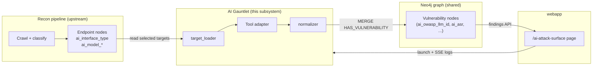

Design constraints that shape everything below:

- **Black-box only.** No source access to the target; every signal comes from
  HTTP request/response behavior.
- **Zero external egress.** All judge/grader/embedding LLM calls are forced to a
  local Ollama container. No payload or transcript ever reaches a hosted API.
- **Deterministic.** Seeds, fixed bounds, pinned tool versions, and a stable
  finding-id hash so re-runs update rather than duplicate.
- **Failure-soft.** A tool that errors on one target yields no findings for it
  but never aborts the job.
- **Zero new node labels.** Findings reuse the existing `Vulnerability` label and
  the existing `HAS_VULNERABILITY` linkage that recon already uses.
- **Never orphaned.** A finding always ends up connected. If recon already mapped
  the attacked `Endpoint`, the finding links straight to it. If the target is
  custom / off-graph (no `Endpoint` exists), the normalizer *materialises* the
  target node chain — `BaseURL -> Endpoint`, anchored to a `Subdomain`+`Domain`
  for a hostname or to an `IP` for a raw IP — marked `source='ai_attack_target'`
  / `ai_attack_synthetic=true`. This mirrors how partial recon materialises
  user-typed inputs, so no finding is ever a disconnected island in the graph.

---

## 2. Repository layout

```
ai_attack_surface_scan/
├── Dockerfile              One image, per-tool venvs (conflicting deps)
├── main.py                 Container entrypoint — the 4-phase "spine"
├── config.py               RunConfig + Bounds, loaded from JSON/env
├── safety.py               RoE + bounds + hard-guardrail floor (fail fast)
├── target_loader.py        Reads selected AI Endpoint nodes from the graph
├── normalizer.py           Unified Finding shape -> Vulnerability writer
├── graph.py                Bare neo4j driver + connection check
├── proc.py                 run_streamed(): live subprocess output -> SSE
├── project_settings.py     Default settings (master toggle + per-tool toggles)
├── output/                 Per-run tool artifacts (configs, reports, transcripts)
└── adapters/
    ├── garak/              python -m garak (REST generator)
    ├── pyrit/              venv subprocess, multi-turn attacks
    ├── giskard/            venv subprocess, LLM-assisted scan
    └── promptfoo/          Node.js CLI, dataset red-team plugins
```

Each adapter package exports a single `run(...) -> list[Finding]` from its
`__init__.py` and ships a `TOOL_API.md` documenting the exact tool contract it was
written against.

The webapp side lives under:

```
webapp/src/
├── app/ai-attack-surface/page.tsx        The operator page (filter, cards, detail, findings)
├── hooks/useAiAttackSurface.ts           Run state, SSE stream, status polling
├── lib/aiAttackSurface.ts                The catalog: chips, tool cards, probe options
└── app/api/ai-attack-surface/[projectId]/...   Next.js proxy routes to the orchestrator
```

---

## 3. The shared spine (`main.py`)

`main.py` is the container entrypoint. It runs four numbered phases in strict
order so the orchestrator's SSE progress only ever advances. The phase markers
(`[Phase 1]` … `[Phase 4]`) are printed to stdout and parsed by the orchestrator.

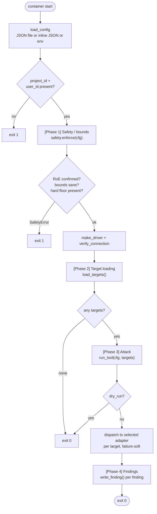

### Phase 1 — Safety / bounds (`safety.py`)

`enforce(cfg)` validates the run before any payload leaves the container:

- `trials >= 1`, `asr_threshold ∈ [0,1]`, `max_turns >= 1` (raise `SafetyError`).
- The **hard-guardrail floor** must be non-empty (`["csam", "cbrn", "bioweapon"]`
  by default) — categories blocked regardless of any other setting.
- **RoE gate:** a non-dry-run launch must have `roe_confirmed=True`, otherwise it
  raises. A launch is a confirmed action.
- Non-fatal warnings (e.g. no judge model set) are returned and logged.

### Phase 2 — Target loading (`target_loader.py`)

Reads the AI surface recon annotated. Two paths:

- **`selected`** (the normal UI path): explicit picker rows
  `{baseurl, path, method}`. Each is matched to its `Endpoint` and enriched. When
  a row is a custom off-graph URL the operator typed, a placeholder `Target` is
  built from the raw selection (carrying any `interface_type` / `model` supplied).
- **Headless** (no selection): loads every attackable chat endpoint. The default
  filter is `["llm-chat", "llm-completion"]` — **not** "any `ai_interface_type`",
  because recon stamps *every* crawled endpoint, mostly with the literal
  `non-llm` sentinel, which is explicitly excluded.

The `Target` dataclass carries `baseurl`, `path`, `method`, and the recon AI
annotations so each adapter can pre-configure its request shape from the graph.

### Phase 3 — Attack (`run_tool`)

`run_tool(cfg, targets)` dispatches to the configured adapter. The dispatch is a
straight `if cfg.tool == ...` ladder for `garak` / `pyrit` / `giskard` /
`promptfoo`; anything else falls back to the Step-2 skeleton (one dummy finding
per target). Each target is attacked inside a `try/except` so one target failing
never aborts the job. Each tool's output goes to
`output/<run_id>/<tool>/<slugified-target>/`.

`cfg.probes` is the shared "selection" field and is overloaded per tool: garak
probe families, pyrit attacks, giskard detectors, promptfoo plugins/chips.

### Phase 4 — Findings (`normalizer.py`)

`write_finding(session, finding, user_id, project_id)` for each finding. See §8.

---

## 4. Configuration model (`config.py`)

The orchestrator writes a JSON config and points the container at it. Resolution
order in `load_config()`:

1. `AI_ATTACK_CONFIG_JSON` — inline JSON (takes precedence).
2. `AI_ATTACK_CONFIG` — path to a JSON file.
3. Env scalars (`PROJECT_ID`, `USER_ID`, `AI_ATTACK_TOOL`, `AI_ATTACK_RUN_ID`).

`RunConfig` fields of note:

| Field | Meaning | UI control (§10) |
|---|---|---|
| `tool` | `garak` / `pyrit` / `giskard` / `promptfoo` / `skeleton` | the card you open |
| `targets` | explicit picker rows `[{baseurl, path, method, ...}]` | Block 1 checkboxes + custom form |
| `bounds.trials` | generations per probe (garak `--generations`) | "Generations" |
| `bounds.asr_threshold` | drop findings below this ASR | "ASR ≥" |
| `bounds.judge_model` | local Ollama judge model id | "Judge" |
| `bounds.max_turns` | multi-turn cap (pyrit) | "Max turns" (multi-turn only) |
| `bounds.seed` | RNG seed (reproducibility) | "Seed" |
| `bounds.parallelism` | concurrent requests to the target (garak `--parallel_attempts`, promptfoo `-j`); default **2**, clamped 1–16. Low for a slow/CPU target so its queue doesn't time out; raise for GPU. | "Parallel" |
| `roe_confirmed` | RoE gate (must be true for a real launch) | RoE checkbox |
| `dry_run` | validate + load targets, send no payloads | not exposed in UI (API-only) |
| `judge_base_url` | local Ollama endpoint | set by the orchestrator at spawn |
| `target_model` | model id the target serves | derived; custom targets set it |
| `api_key` / `auth_header` / `auth_scheme` | target auth | Target authentication block |
| `probes` | per-tool probe/plugin/detector/attack selection | Block 2 |
| `target_purpose` | free-text app description | "Target purpose" (giskard/promptfoo/pyrit) |
| `strategies` | promptfoo payload-mutation strategies | "Strategies" (promptfoo only) |
| `objective` | pyrit custom attack objective | "Custom objective" (pyrit only) |

Auth resolves to three modes: `none` (empty key+header), `bearer`
(`api_key=<token>`, `auth_header=Authorization`, `auth_scheme=Bearer`), and
`custom` (`api_key=<value>`, `auth_header=<name>`, optional scheme). The resolution
lives client-side in `resolveAuth()` (`aiAttackSurface.ts`).

---

## 5. Container packaging (`Dockerfile`)

One image, **per-tool virtualenvs**. The tools' dependencies conflict and cannot
share one environment (garak needs `datasets<4.0`; pyrit needs `>=4.8.0`;
promptfoo is Node.js). So:

- The **shared spine** (neo4j driver + main/target_loader/safety/normalizer) runs
  in the **base interpreter**.
- Each Python tool gets its own venv: `/opt/venv-garak`, `/opt/venv-pyrit`,
  `/opt/venv-giskard`. The adapter invokes the tool via that venv's interpreter as
  a subprocess (`GARAK_PYTHON`, `PYRIT_PYTHON`, `GISKARD_PYTHON` env vars).
- **promptfoo** is a global npm install of a pinned version (Node 22), not a venv,
  invoked as the `promptfoo` CLI.

Egress controls baked into the image: promptfoo telemetry/update/remote-generation
disabled via `PROMPTFOO_DISABLE_*` env. `PYTHONUNBUFFERED=1` so logs stream live.
`CMD` runs `python ai_attack_surface_scan/main.py`.

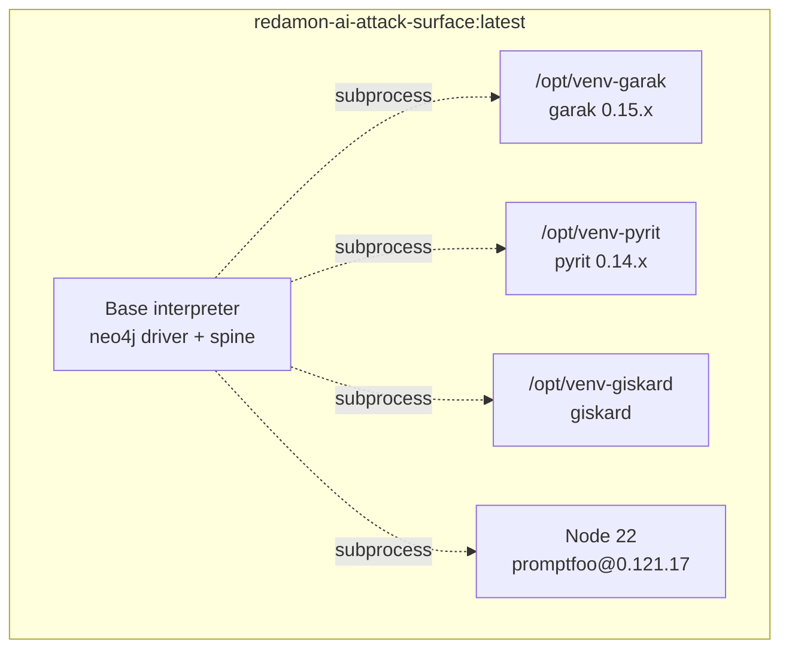

---

## 6. The four tools — overview

All four adapters share the same shape: build a tool-specific config from the
`Target` + bounds, invoke the tool as a subprocess via `proc.run_streamed`
(streaming progress to the container log), parse the tool's native output into the
unified `Finding`, filter by `asr_threshold`, and return `list[Finding]`. All four
strip `OPENAI_API_KEY` from the subprocess env and force any judge to local
Ollama.

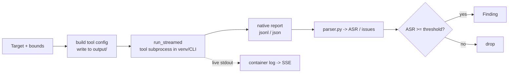

### Comparison

| | garak | PyRIT | Giskard | promptfoo |
|---|---|---|---|---|
| Runtime | venv `python -m garak` | venv runner script | venv runner script | Node.js CLI (2-step) |
| Style | broad single-shot | bounded multi-turn | LLM-assisted scan | dataset red-team eval |
| Selection unit | probe family | attack | detector tag | plugin (+ strategy) |
| Metric | ASR per family | ASR per attack | binary (1.0) per detector | ASR per plugin |
| Judge | optional (degrades) | required | required | required |
| Default selection | promptinject, dan, encoding, leakreplay | crescendo | prompt_injection, information_disclosure | beavertails, pliny |
| OWASP coverage | LLM01/02/03/05/07/09 + safety | LLM01 | LLM01/02/05/09 + safety | LLM01/02/05/07 + safety |
| Oracle kinds | classifier / contains / judge_llm | judge_llm | judge_llm | judge_llm |
| Catalog size in UI | 40 families (5 capability-gated) | 4 attacks | 7 detectors | 3 plugins + 6 strategies |

The "chip" column (prompt-injection, jailbreak, data-disclosure, …) is the shared
attack vocabulary used everywhere: it labels probes, colors findings, and links to
OWASP-LLM ids. The chip set is defined once in `ATTACK_CHIPS` (`aiAttackSurface.ts`).

---

## 7. Advanced tool reference

Each subsection drills into the exact invocation, the request shaping, the scoring
math, and the per-tool quirks.

### 7.1 garak — broad single-shot scanner

**Invocation** (`adapters/garak/runner.py`):

```
python -m garak --model_type rest --generator_option_file garak_rest.json \
  --probes <families> --generations <trials> --seed <seed> \
  --report_prefix <path> --parallel_attempts <parallelism>
```

**REST generator** (`rest_config.py`): garak's `rest` model type is fully driven by
a JSON option file the adapter generates. The adapter infers the API family from
the path (`openai-chat`, `openai-completion`, `anthropic`, `ollama-chat`,
`ollama-generate`), builds the request template (with garak's `$INPUT` placeholder),
the response JSONPath (e.g. `$.choices[0].message.content`), the auth header
(`<scheme> $KEY`), and writes `garak_rest.json`. garak substitutes `REST_API_KEY`
(from env) into `$KEY` and `request_timeout` is 60s.

**Scoring** (`parser.py`): garak emits a `*.report.jsonl`. The parser keys on the
stable `eval` rows (`probe`, `detector`, `fails`, `total_evaluated`), groups by
probe *family*, and takes the detector with the highest ASR per family.
`ASR = fails / total_evaluated`. Severity buckets: ≥0.5 high, ≥0.3 medium, >0 low,
else info. This parsing is deliberately version-neutral (it ignores the
version-sensitive `attempt` rows).

**Mapping** (`owasp_map.py`): probe family → `(owasp_llm_id, chip, oracle_kind)`.
The table covers garak's full 0.15.x catalog (promptinject→LLM01, leakreplay→LLM02,
sysprompt_extraction→LLM07, packagehallucination→LLM03, ansiescape→LLM05, …) with a
`LLM01 / prompt-injection / classifier` fallback for unknown families. Some families
are graded by the local judge (`tap`, `malwaregen`, `exploitation`); the
egress guard keeps that judge on Ollama.

```mermaid
sequenceDiagram
    participant A as garak adapter
    participant R as runner.py
    participant G as garak (venv)
    participant T as target
    participant J as Ollama judge
    A->>A: build garak_rest.json (family-inferred)
    A->>R: run_garak_scan(probes, generations, seed)
    R->>R: strip OPENAI_API_KEY; force judge env to Ollama
    R->>G: python -m garak --model_type rest ...
    loop per probe x generations
        G->>T: POST payload (REST template)
        T-->>G: completion
        opt judge-based detector
            G->>J: grade output
        end
    end
    G-->>R: *.report.jsonl
    R-->>A: report path
    A->>A: parse_report -> per-family ASR -> Finding[]
```

**Advanced notes:**
- `--parallel_attempts <parallelism>` (the "Parallel" bound, default 2) sets how many
  requests hit the target at once. Keep it low for a slow/CPU target — too many
  concurrent requests back its queue up past the REST `request_timeout`, which 500s
  and can crash the run; raise it for a fast/GPU target. Whole families can still be
  slow on CPU regardless. Victim replies are also capped (`max_tokens`/`num_predict`,
  default 512, env `AI_ATTACK_RESPONSE_MAX_TOKENS`) so a runaway generation can't time out.
- Selecting a *family* runs all its sub-probes. The UI passes family ids verbatim.
- Capability-gated families (multimodal, white-box, file-output, agentic) exist in
  the catalog but are not attackable by a black-box HTTP chat target — see §10.4.
- Output: `garak_rest.json`, `garak_run.report.jsonl` (the `ai_transcript_ref`).

### 7.2 PyRIT — bounded multi-turn attacks

**Invocation:** `PYRIT_PYTHON pyrit_run.py <config.json>` (an isolated runner script
in the venv). The adapter writes `pyrit_<attack>_config.json` per selected attack and
reads back `pyrit_<attack>.json`.

**Targets/judge** (`pyrit_run.py`): the victim is an `OpenAIChatTarget` (endpoint
normalized to `.../v1`, `temperature=0.0`, seeded). The judge is a separate
`OpenAIChatTarget` pointed at local Ollama with `api_key="ollama-local"`. Auth maps
to the SDK's `Authorization: Bearer` for bearer mode, or a custom headers JSON for
custom mode.

**Attacks** (`objectives.py`):

| Attack | PyRIT class | Shape |
|---|---|---|
| `crescendo` (default) | `CrescendoAttack` | gradual multi-turn escalation, `max_turns` + `max_backtracks=5` |
| `skeleton_key` | `SkeletonKeyAttack` | single safety-override prompt |
| `tap` | `TAPAttack` | tree-of-attacks: attacker model branches/prunes, scale scorer |
| `many_shot` | `ManyShotJailbreakAttack` | faux-compliant Q/A priming then the real ask |

Each attack ships bounded, *mild* jailbreak objectives (system-prompt reveal,
refusal escalation) — the hard-guardrail floor blocks CSAM/CBRN/bioweapon, so those
can never be objectives. A custom `objective` from the UI overrides all built-in
objectives. Objectives are framed with `target_purpose` so the attacker model
tailors its turns to the app.

**Scoring** (`parser.py`): each objective yields an outcome
(`SUCCESS`/`FAILURE`/`UNDETERMINED`/`ERROR`). `ASR = successes / scored` (errors
excluded from the denominator). One `Finding` per attack, `chip="jailbreak"`,
`ai_owasp_llm_id="LLM01"`, `ai_oracle_kind="judge_llm"`, with the winning objective
and turn count in the evidence.

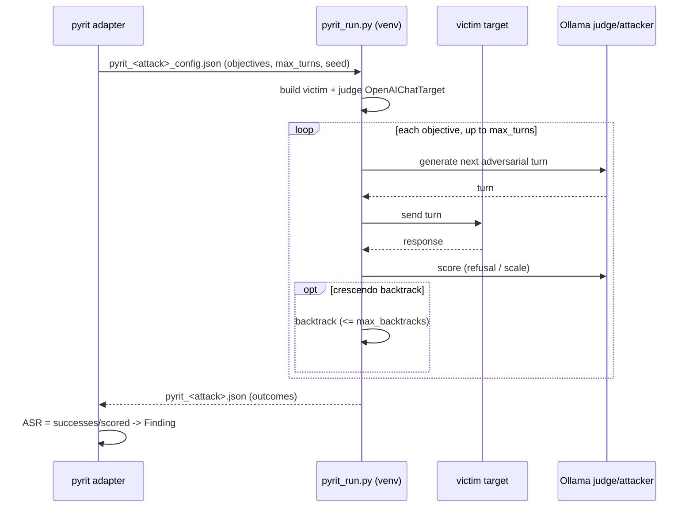

**Advanced notes:**
- `max_turns` is the only bound that is pyrit-specific in the UI; it is hidden for
  single-shot tools.
- Returns `[]` immediately if no `judge_base_url` (no degraded mode — the attack
  needs a grader/attacker model).
- Output: `pyrit_<attack>_config.json`, `pyrit_<attack>.json`.

### 7.3 Giskard — LLM-assisted vulnerability scan

**Invocation:** `GISKARD_PYTHON giskard_run.py <config.json>`.

**Target wrapping** (`giskard_run.py`): the target is wrapped in a `giskard.Model`
(`model_type="text_generation"`) whose `predict` makes direct family-inferred HTTP
calls (90s per-request timeout). The model `description` (from `target_purpose`)
drives giskard's domain-specific test generation — a precise description sharply
improves detection.

**Judge + embeddings forced local:** the runner calls
`giskard.llm.set_llm_model("ollama/<judge_model>", api_base=<judge>/...)` and
`set_embedding_model("ollama/nomic-embed-text", ...)`. No `OPENAI_API_KEY` is ever
set, so even a misconfiguration cannot egress. Returns `[]` if no `judge_base_url`
(mandatory).

**Detectors** (`detectors.py`): the UI passes semantic *tags*
(`prompt_injection`, `information_disclosure`, `hallucination`, `harmfulness`,
`stereotypes`, `sycophancy`, `output_formatting`) to `giskard.scan(only=...)`. Issue
detector names are mapped back to OWASP ids by substring matching.

**Scoring** (`parser.py`): giskard is a *scanner*, not a trials harness — it returns
issues, not a success rate. So each detector with issues yields one `Finding` with
`ai_asr = 1.0` (binary: vulnerable), `ai_trials = sum(num_examples)` (or issue
count), severity = the worst issue's severity, `ai_oracle_kind = "judge_llm"`.

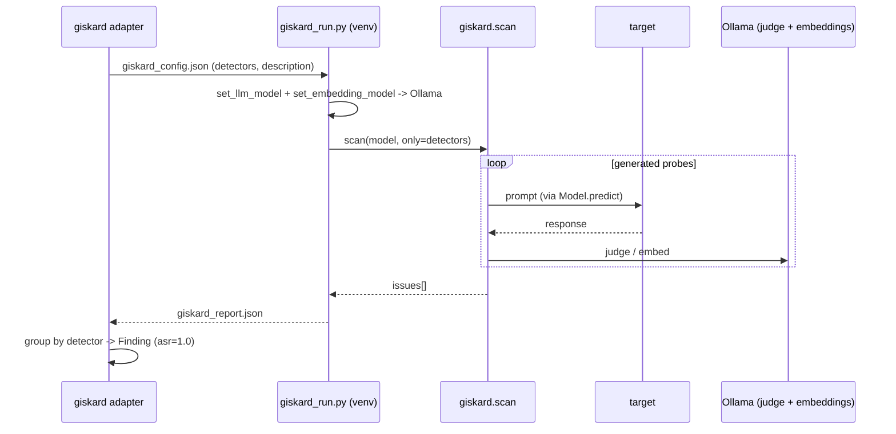

**Advanced notes:**
- `ai_asr = 1.0` means findings sort to the top of the ASR-ordered findings table;
  read giskard severity, not ASR, for prioritization.
- Output: `giskard_config.json`, `giskard_report.json`.

### 7.4 promptfoo — dataset red-team eval (Node.js)

**Invocation:** the two-step CLI —

```
promptfoo redteam generate -c promptfoo_config.json -o promptfoo_redteam.json --no-progress-bar
promptfoo eval -c promptfoo_redteam.json -o promptfoo_results.json --no-table --no-progress-bar
```

If `generate` produces nothing, `eval` is skipped (graceful).

**Provider config** (`provider_config.py`): an `https` provider points at the target
with a family-specific body template (`{{prompt}}`) and a `transformResponse`
JSONPath. The auth header carries `{{env.REDAMON_TARGET_KEY}}`, injected at runtime.
The grader is `openai:chat:<judge_model>` with `apiBaseUrl` = local Ollama and a
dummy key (`sk-noop`). `numTests` defaults to 5 (env `AI_ATTACK_PROMPTFOO_NUMTESTS`).

**Plugins vs strategies** (`plugins.py`): promptfoo separates the *vulnerability*
(plugin) from the *delivery* (strategy).
- Default plugins: `beavertails`, `pliny` — the verified single-turn dataset plugins.
  `harmbench` is also offered. Conversation-style dataset plugins (cyberseceval,
  donotanswer) and generation-based plugins (pii, harmful, indirect-prompt-injection)
  are intentionally excluded from defaults: with a small local model they emit empty
  or conversation-shaped payloads.
- Strategies are pure local text transforms only:
  `{basic, base64, rot13, leetspeak, morse, piglatin}`. Remote/adaptive strategies
  (jailbreak, crescendo, multilingual, …) are dropped with a warning to prevent
  egress.

**Egress nuance:** dataset plugins fetch their payloads from HuggingFace
(public, read-only) at generate time — the one benign outbound fetch. The image
does **not** pre-warm or disk-cache the dataset (the Dockerfile is authoritative on
this; a stale comment in `aiAttackSurface.ts` says "pre-warmed into the image" — it
is live-fetched at scan time). Grading is fully local.

**Scoring** (`parser.py`): per `(plugin, strategy)` cell, a hit = the attack
succeeded = the model *failed* to resist (the `success` field is inverted). Rows
with `failureReason == 2` (ERROR) are dropped. Plugin ASR = hits / scoreable trials
across all its strategies. One `Finding` per plugin, recording the worst strategy in
the evidence.

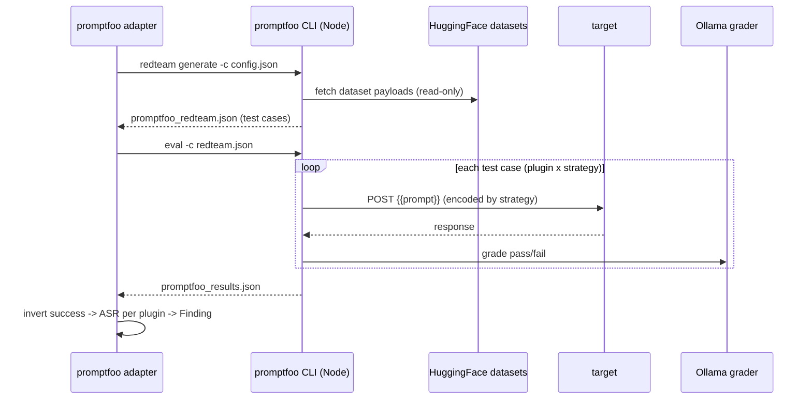

**Advanced notes:**
- Strategies multiply the payload count (each strategy re-encodes each dataset
  payload), so adding strategies lengthens the run.
- Output: `promptfoo_config.json`, `promptfoo_redteam.json`, `promptfoo_results.json`.

---

## 8. Findings → Neo4j (`normalizer.py`)

Every parser emits the **same** `Finding` dataclass. The normalizer maps it onto
the existing `Vulnerability` label — **zero new node labels**.

```mermaid
flowchart TD
    F[Finding from any tool] --> ID["finding_id()<br/>sha256(source | owasp/chip |<br/>payload_class | baseurl | path)[:16]<br/>-> aiatk_&lt;hash&gt;"]
    ID --> MERGE["MERGE (v:Vulnerability {id})<br/>ON CREATE SET first_seen<br/>SET v += props, updated_at"]
    MERGE --> LINK{Endpoint match?<br/>baseurl + path<br/>(prefer ai-typed)}
    LINK -->|yes| E["(e:Endpoint)-[:HAS_VULNERABILITY]->(v)<br/>returns linked=true"]
    LINK -->|no| FB["Fallback:<br/>BaseURL -> Subdomain -> Domain<br/>coalesce parent -[:HAS_VULNERABILITY]-> v"]
```

Key points:

- **Deterministic id** (`finding_id`): `aiatk_<sha16>` keyed on source + OWASP-LLM
  id (or chip) + payload class + target. Re-running the same tool against the same
  target **updates** rather than duplicates. Mirrors recon's `aisr_<sha16>`
  convention.
- **Properties written** (`_props`): `source`, `type` (`ai_attack_<chip>`),
  `ai_target_url`, `name`, `severity`, `description`, `evidence`,
  `ai_owasp_llm_id`, `ai_atlas_technique`, `ai_asr`, `ai_trials`,
  `ai_oracle_kind`, `ai_payload_class`, `ai_transcript_ref`,
  `ai_probe_pack_version`, plus tenant keys `user_id` / `project_id`.
- **Linkage:** prefer the AI-typed `Endpoint` on the exact `{baseurl, path}`. If
  none exists (e.g. a custom off-graph target), fall back to the coarsest existing
  parent (`BaseURL` → `Subdomain` → `Domain`) so a finding never orphans. The
  `ai_target_url` property still displays the attacked URL even when nothing links.
- `write_finding` returns `True` if it linked to a specific `Endpoint`, `False`
  if it fell back. `main.py` reports the linked count.

`ai_transcript_ref` points at the on-disk artifact (garak's report.jsonl, pyrit's
results json, etc.) so the UI can fetch the proof transcript on demand.

### 8.1 What every tool writes (shared attribute contract)

Regardless of tool, each finding becomes one `Vulnerability` node with this fixed
attribute set (written by `normalizer._props`):

| Attribute | Source | Notes |
|---|---|---|
| `id` | `aiatk_<sha16>` | dedup key (source + owasp/chip + payload_class + target) |
| `user_id`, `project_id` | run config | tenant keys |
| `source` | the tool name | `garak` / `pyrit` / `giskard` / `promptfoo` |
| `type` | `ai_attack_<chip>` | chip with `-`→`_` (e.g. `ai_attack_prompt_injection`) |
| `name` | per-tool, human label | see §8.2 |
| `severity` | per-tool bucket | `critical`/`high`/`medium`/`low`/`info` |
| `description` | per-tool | longer detail |
| `evidence` | per-tool | the proof one-liner shown in the table |
| `ai_owasp_llm_id` | per-tool mapping | `LLM01`..`LLM10` or the `safety` pseudo-id |
| `ai_asr` | per-tool | attack success rate (giskard is always `1.0`) |
| `ai_trials` | per-tool | denominator / variant count |
| `ai_oracle_kind` | per-tool | how the verdict was reached |
| `ai_payload_class` | `<tool>-<unit>` | e.g. `garak-dan`, `pyrit-crescendo` |
| `ai_transcript_ref` | output path | the on-disk proof artifact |
| `ai_probe_pack_version` | `<tool>/<version>` | reproducibility stamp |
| `ai_target_url` | `baseurl+path` | shown even when no Endpoint links |
| `ai_atlas_technique` | reserved | **always null today** — no adapter populates it yet |
| `first_seen` | `datetime()` on create | set once |
| `updated_at` | `datetime()` every write | re-run bumps this, not `first_seen` |

Linkage (`(parent)-[:HAS_VULNERABILITY]->(v)`) is identical for all tools: prefer the
AI-typed `Endpoint` on the exact `{baseurl, path}`, else fall back BaseURL → Subdomain
→ Domain. No tool adds or mutates any *other* node type — recon owns the `Endpoint`
attributes; the attack layer only adds `Vulnerability` nodes and the
`HAS_VULNERABILITY` edge to them.

### 8.2 How each tool fills those attributes

This is the concrete "tool output → node attribute" contract, with node
**granularity** (how many `Vulnerability` nodes one run creates).

**garak** — one node per probe *family* whose ASR ≥ threshold:

| Node attribute | Filled from garak output |
|---|---|
| `name` | `garak <family>: ASR <pct>` |
| `ai_owasp_llm_id`, `chip→type`, `ai_oracle_kind` | `owasp_map.map_family(family)` (e.g. `dan`→LLM01/jailbreak/classifier) |
| `ai_asr` | `fails / total_evaluated` of the family's worst detector |
| `ai_trials` | `total_evaluated` of that detector |
| `severity` | ASR bucket (≥0.5 high, ≥0.3 medium, >0 low, else info) |
| `ai_payload_class` | `garak-<family>` |
| `ai_probe_pack_version` | `garak/<report version>` |
| `evidence` | `<top_probe>/<top_detector> hits=<h>/<n>` |
| `ai_transcript_ref` | `…/garak_run.report.jsonl` |

**PyRIT** — one node per selected *attack* whose ASR ≥ threshold:

| Node attribute | Filled from pyrit output |
|---|---|
| `name` | `PyRIT <attack>: ASR <pct>` |
| `ai_owasp_llm_id` / `chip` | always `LLM01` / `jailbreak` (`objectives.py`) |
| `ai_asr` | `successes / scored` (ERROR outcomes excluded) |
| `ai_trials` | `scored` (objectives graded) |
| `ai_oracle_kind` | `judge_llm` |
| `severity` | ASR bucket |
| `ai_payload_class` | `pyrit-<attack>` (`_`→`-`, e.g. `pyrit-skeleton-key`) |
| `ai_probe_pack_version` | `pyrit/<version>` |
| `evidence` | winning objective + turn count |
| `ai_transcript_ref` | `…/pyrit_<attack>.json` |

**Giskard** — one node per *detector* that produced issues (issues aggregated):

| Node attribute | Filled from giskard output |
|---|---|
| `name` | `giskard <detector>: <worst severity>` |
| `ai_owasp_llm_id` / `chip` | `detector_meta(detector)` by substring (e.g. `…disclosure`→LLM02) |
| `ai_asr` | **always `1.0`** (scanner: issue present/absent, not a rate) |
| `ai_trials` | `sum(num_examples)` across the detector's issues, else issue count |
| `ai_oracle_kind` | `judge_llm` |
| `severity` | worst issue severity mapped (`major`→high, `medium`→medium, `minor`→low) |
| `ai_payload_class` | `giskard-<detector>` |
| `ai_probe_pack_version` | `giskard/<version>` |
| `evidence` | `<detector>: <n> issue(s) (worst: <sev>)` |
| `ai_transcript_ref` | `…/giskard_report.json` |

**promptfoo** — one node per *plugin* whose ASR ≥ threshold (and trials > 0):

| Node attribute | Filled from promptfoo output |
|---|---|
| `name` | `promptfoo <plugin>: ASR <pct>` |
| `ai_owasp_llm_id` / `chip` | `plugins.map_plugin(plugin)` (e.g. `beavertails`→safety/toxicity) |
| `ai_asr` | hits / scoreable trials across all the plugin's strategies (hit = model failed to resist) |
| `ai_trials` | scoreable trials for the plugin (ERROR rows dropped) |
| `ai_oracle_kind` | `judge_llm` |
| `severity` | ASR bucket |
| `ai_payload_class` | `promptfoo-<plugin>` |
| `ai_probe_pack_version` | `promptfoo/<version>` |
| `evidence` | `<plugin>: <h>/<n> (worst: <strategy>)` |
| `ai_transcript_ref` | `…/promptfoo_results.json` |

Because the node `id` hashes `source + owasp/chip + payload_class + target`, two
runs of the same tool against the same target **update the same node** (refreshing
`ai_asr`/`ai_trials`/`evidence`/`updated_at`) rather than creating duplicates — so
the graph always reflects the latest measurement per (tool, attack-unit, target).

---

## 9. Container spawn lifecycle

The scan container is spawned by `recon_orchestrator/container_manager.py`
(`start_ai_attack_surface`), driven by an HTTP route in the orchestrator, which the
webapp calls through a Next.js API proxy.

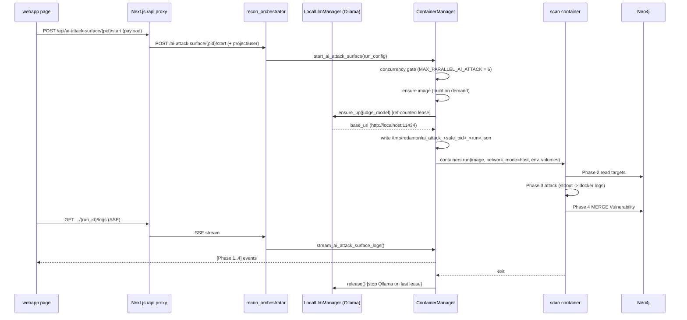

Spawn specifics (`container_manager.py`):

- **Image:** `redamon-ai-attack-surface:latest`, built on demand if missing.
- **Concurrency gate:** `MAX_PARALLEL_AI_ATTACK = 6` per project (a backstop; the UI
  itself enforces one scan at a time).
- **Network:** `network_mode="host"` so the container reaches the judge at
  `http://localhost:11434` and any local target.
- **Env passed in:** `PROJECT_ID`, `USER_ID`, `WEBAPP_API_URL`, `AI_ATTACK_TOOL`,
  `AI_ATTACK_RUN_ID`, `AI_ATTACK_CONFIG` (the config path),
  `NEO4J_URI/USER/PASSWORD`, `INTERNAL_API_KEY`, `PYTHONUNBUFFERED=1`.
- **Config file:** `/tmp/redamon/ai_attack_<safe_pid>_<run_id>.json` (project_id
  sanitized), bind-mounted in.
- **Volumes:** `/tmp/redamon` (config) + the `ai_attack_surface_scan/` source bind
  (so output artifacts land back on the host, and code edits need no rebuild).
- **One container per tool per launch.** On a failed spawn the judge lease is
  released and the config file unlinked, so nothing leaks.

### The local Ollama judge (zero-egress)

`LocalLlmManager` brings up a ref-counted `ollama/ollama:latest` container
(`redamon-local-llm`) on demand:

- Orchestrator reaches it via container DNS (`http://redamon-local-llm:11434`); the
  **scan container** reaches it via the published port (`http://localhost:11434`,
  passed in as `judge_base_url`).
- Model weights (default `qwen2.5:7b`) are pulled once and cached in the
  `redamon_llm_models` volume, surviving container removal.
- Leases are ref-counted; the Ollama container is stopped/removed when the last scan
  releases it. A background reaper (~30s) refreshes orphaned runs so a closed UI tab
  still releases the lease.

If the judge cannot come up, the scan still proceeds with a warning — garak degrades
to no-judge detectors, while pyrit/giskard/promptfoo return no findings.

### SSE progress streaming

`main.py` prints `[Phase 1]` … `[Phase 4]` and `[+]/[!]/[*]` status lines to stdout.
`container_manager` tails the Docker logs, strips ANSI, parses the RFC3339Nano
timestamps, matches the phase patterns (`AI_ATTACK_SURFACE_PHASE_PATTERNS`), and
yields `AiAttackSurfaceLogEvent`s. The orchestrator re-emits them as SSE `log`
events; the webapp hook consumes the stream and drives the phase indicator. Full
history is replayed on each reconnect so a page refresh preserves state.
`proc.run_streamed` is what makes long tool runs visible — it pipes combined
stdout+stderr live (splitting on `\n` and `\r` so tqdm bars surface) and enforces an
overall timeout (default 3600s) even when the child is silent.

---

## 10. The operator UI — what is controllable

The page (`webapp/src/app/ai-attack-surface/page.tsx`) has four regions: a **filter
bar**, a **tool-card grid**, a **detail/config view** (four numbered blocks), and a
**findings table**. State and I/O live in `useAiAttackSurface.ts`; the selectable
vocabulary lives in `aiAttackSurface.ts`.

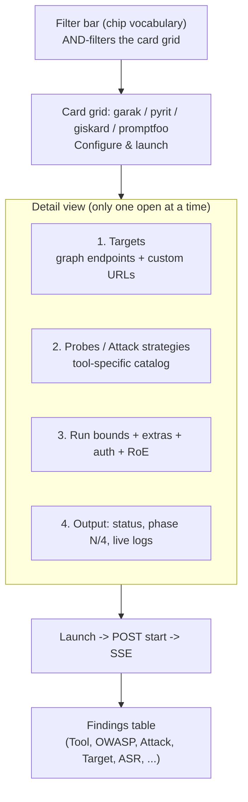

### 10.1 Filter bar (the chip vocabulary)

Eleven attack chips are the shared vocabulary (`ATTACK_CHIPS`): prompt-injection,
jailbreak, system-prompt-leak, data-disclosure, encoding-bypass, toxicity, bias,
hallucination, harmful-generation, insecure-output, supply-chain. Each chip carries
a label, color, OWASP-LLM id, and a one-line definition (shown on hover). Selecting
chips **AND-filters** the card grid: a card shows only if it advertises *every*
selected chip (`filters.every(chip => card.chips.includes(chip))`). "Clear" resets.

### 10.2 Tool-card grid

Each `ToolCard` renders its name, `style` (single-shot / multi-turn / scan / eval),
`purpose`, `requires` (surface needed, e.g. "chat"), and its chips. The
"Configure & launch" button opens the detail view. Card states:

- **greyed** — `available === false` (adapter not shipped); button hidden, shows
  "coming soon". All four current tools are available.
- **running** — this tool's scan is in flight; the button shows a spinner and
  "Running…".
- **lockedByRun** — a *different* tool is running; the button shows "Locked" and is
  disabled. **Only one scan runs at a time** by design.

A card opens even with zero discovered endpoints, so the operator can still attack a
custom off-graph URL.

### 10.3 Block 1 — Targets

Two sources, combined into the launch `targets[]`:

- **Graph endpoints** — checkboxes for each `llm-chat` / `llm-completion` `Endpoint`
  (from `GET /targets`), labelled `baseUrl+path` with `interfaceType · modelFamily`
  context. Selection key is `baseUrl|path`. Sent as `{baseurl, path, method}`.
- **Custom (off-graph) targets** — a form: full URL + interface-type dropdown
  (`llm-chat` / `llm-completion`) + optional model. `splitUrl()` parses it; invalid
  URLs surface an inline error. Sent with `custom: true` and the operator's
  `interface_type` / `model` so the request shape can be inferred without a graph
  node. Custom rows are removable.

### 10.4 Block 2 — Probes / Attack strategies (tool-specific)

The block title is "Attack strategies" for multi-turn (pyrit) and "Probes"
otherwise. The grid renders one selectable card per probe with its label,
description, and chip. What is selectable per tool:

| Tool | Selectable units (UI ids) | Default-checked |
|---|---|---|
| garak | 28 visible probe families (promptinject, dan, encoding, leakreplay, latentinjection, goodside, grandma, dra, phrasing, suffix, tap, sata, sysprompt_extraction, apikey, divergence, realtoxicityprompts, lmrc, continuation, atkgen, topic, malwaregen, exploitation, ansiescape, web_injection, badchars, packagehallucination, misleading, snowball) — inactive-by-default families (doctor, donotanswer, fitd, goat, propile, smuggling, av_spam_scanning) are excluded as they abort the run | promptinject, dan, encoding, leakreplay |
| pyrit | crescendo, skeleton_key, tap, many_shot | crescendo |
| giskard | prompt_injection, information_disclosure, hallucination, harmfulness, stereotypes, sycophancy, output_formatting | prompt_injection |
| promptfoo | pliny, beavertails, harmbench | pliny |

**Capability gating:** five garak families carry a `requires` flag — `agent_breaker`
(agentic target), `glitch` (white-box tokenizer), `audio` and `visual_jailbreak`
(multimodal), `fileformats` (file output). They cannot produce findings against a
black-box HTTP chat target, so the grid filters them out
(`probes.filter(p => !p.requires)`). The catalog comments describe showing them
"disabled but visible"; in the current code the filter removes them entirely, so the
disabled-badge branch is effectively dead (see §11).

**Probe toolbar** appears when a card has more than 6 probes (garak, giskard):
"Select all" (non-gated only), "Reset to defaults", "Clear", plus an
`N / M selected` counter. The defaults are the `default:true` probes, or the first
probe if none are flagged.

### 10.5 Block 3 — Run bounds, extras, auth, RoE

Always shown:

| Control | Widget | Maps to | Consumed by |
|---|---|---|---|
| Generations | number ≥1 | `bounds.trials` | garak `--generations` |
| ASR ≥ | number 0–1, step 0.05 | `bounds.asr_threshold` | all (finding filter) |
| Judge | text (default `qwen2.5:7b`) | `bounds.judge_model` | all judges; selects the Ollama model |
| Seed | number ≥0 | `bounds.seed` | garak/pyrit reproducibility |

Conditionally shown:

- **Max turns** (number) — only for multi-turn (pyrit) → `bounds.max_turns`.
- **Strategies** (chip buttons) — only promptfoo → `strategies[]`
  (basic/base64/rot13/leetspeak/morse/piglatin).
- **Custom objective** (text) — only pyrit → `objective` (overrides built-in goals).
- **Target purpose** (textarea) — for giskard/promptfoo/pyrit → `target_purpose`
  (sharpens generated/graded attacks).
- **Target authentication** (shared) — radio None / Bearer / Custom header:
  - Bearer → password field → `Authorization: Bearer <token>`.
  - Custom → header name (default `x-api-key`) + password value → that header.
  - Resolved by `resolveAuth()` into `{api_key, auth_header, auth_scheme}`.
- **RoE confirmation** (checkbox, mandatory) — "I confirm this is an authorized,
  in-scope target." → `roe_confirmed`.

**Launch gating** (`canLaunch`): at least one target, at least one probe selected,
RoE confirmed, and nothing already launching/running. A **Stop** button appears
while running.

> `dry_run` exists in the payload type and the orchestrator path but is **not**
> exposed as a UI control — it is API-only (useful for scripted validation).

### 10.6 Block 4 — Output

Shows the live run: `Status: <status>`, `Phase <n>/4: <name>`, an animated scan bar
while running, and the streamed log lines colored by level (`error`/`success`/
`action`/`info`). The viewport auto-pins to the bottom as lines arrive.

### 10.7 Run-state machine (the hook)

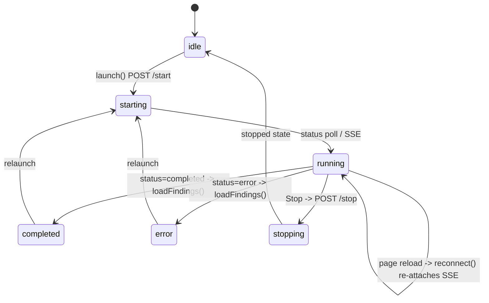

`useAiAttackSurface` opens an `EventSource` on `/logs` and polls `/status` every 3s.
On `completed`/`error` it closes the stream and reloads findings. On mount it calls
`reconnect()` — `GET /all`, find any `running`/`starting` run, and re-attach the SSE
stream — so a page refresh restores status, phase, and live logs (the server replays
full log history on reconnect). `stop()` freezes the stream immediately for instant
feedback, then reconciles with the authoritative stopped state.

### 10.8 Findings table

`GET /findings` returns `Vulnerability` nodes with `source IN
[garak,pyrit,giskard,promptfoo]`, ordered by `ai_asr DESC, severity`. Columns:
Tool, OWASP, Attack (`ai_payload_class`), Target (linked node, or `ai_target_url`
for off-graph), ASR (%), Trials, Severity (colored dot), Evidence, and Report (a
"view" link to `/transcript?ref=<ai_transcript_ref>` opening the on-disk proof).

---

## 11. Deep UI evaluation

**Strengths**

- **Single source of truth.** The chip vocabulary, tool cards, and probe catalog all
  live in `aiAttackSurface.ts`; the page renders from it generically, so adding a
  probe is a one-line catalog change.
- **Stateful across reloads.** `reconnect()` + full-history SSE replay means a
  refresh mid-scan loses nothing.
- **Safe by construction.** RoE is a hard launch gate; only one scan runs at a time;
  capability-impossible probes are removed from the grid; auth values use password
  inputs with `autoComplete="off"`.
- **Honest result semantics.** ASR is shown as a percentage with trial counts, and
  every finding links to its raw transcript — no black-box "trust me" verdicts.

**Behaviors worth knowing**

- **One scan at a time.** Launching is blocked while any tool runs; other cards show
  "Locked". This is intentional (shared judge, shared log pane), not a limit of the
  backend (which gates at 6).
- **giskard ASR is always 100%.** It is a scanner, so `ai_asr = 1.0`; it sorts to the
  top of the ASR-ordered table regardless of real severity. Prioritize by the
  severity column for giskard rows.
- **"Generations" only really drives garak.** giskard ignores it (binary), promptfoo
  uses its own `numTests` (env default 5), pyrit uses `max_turns` + objective count.
  The single "Generations" field is a slight over-generalization across tools.

**Gaps / latent issues**

- **Dead capability-gated branch.** The grid does
  `openCard.probes.filter(p => !p.requires)`, so gated probes (audio, visual,
  glitch, fileformats, agent_breaker) never render. The inner `blocked`/`needs …`
  badge code and the catalog's "stay visible so the operator sees why" comment can
  therefore never trigger. Either the filter should be dropped (to show them
  disabled) or the dead branch removed — currently the operator gets no signal that
  these families exist or why they are unavailable.
- **Stale dataset comment.** `PROMPTFOO_CARD`'s comment says payloads are
  "pre-warmed into the image"; the Dockerfile (authoritative) live-fetches from
  HuggingFace at scan time. Cosmetic, but misleading for air-gap planning.
- **Initial probe state is garak-specific.** `selectedProbes` initializes to garak's
  four defaults; it is corrected by `openConfig()` on open, so this is harmless but
  fragile if the open flow changes.

---

## 12. Output artifacts on disk

Each run writes under `ai_attack_surface_scan/output/<run_id>/<tool>/<slug>/`, where
`<slug>` is the slugified `baseurl+path`:

| Tool | Files |
|---|---|
| garak | `garak_rest.json`, `garak_run.report.jsonl` |
| pyrit | `pyrit_<attack>_config.json`, `pyrit_<attack>.json` |
| giskard | `giskard_config.json`, `giskard_report.json` |
| promptfoo | `promptfoo_config.json`, `promptfoo_redteam.json`, `promptfoo_results.json` |

These are the source of truth behind each finding's `ai_transcript_ref`, and they
persist on the host because the source directory is bind-mounted.

---

## 13. Safety model summary

- **RoE gate** — no real launch without `roe_confirmed=True` (`safety.enforce` + UI
  checkbox).
- **Hard-guardrail floor** — `csam`/`cbrn`/`bioweapon` blocked before any payload
  leaves the container, independent of all other settings.
- **Zero egress** — `OPENAI_API_KEY` stripped from every subprocess; all
  judge/grader/embedding traffic forced to local Ollama; promptfoo telemetry/update/
  remote-generation disabled. The only outbound traffic is promptfoo's read-only
  HuggingFace dataset fetch.
- **Bounded** — trials, max turns, per-request timeouts, and a hard overall timeout
  (default 3600s) on every tool subprocess.
- **Determinism** — seeds on victim + judge, pinned tool versions, stable finding
  ids — re-runs converge instead of multiplying findings.
- **Master toggle OFF by default** (`project_settings.py`): the profile sends
  adversarial payloads, so it is opt-in; per-tool sub-toggles default ON once the
  profile is enabled.

---

## 14. End-to-end summary

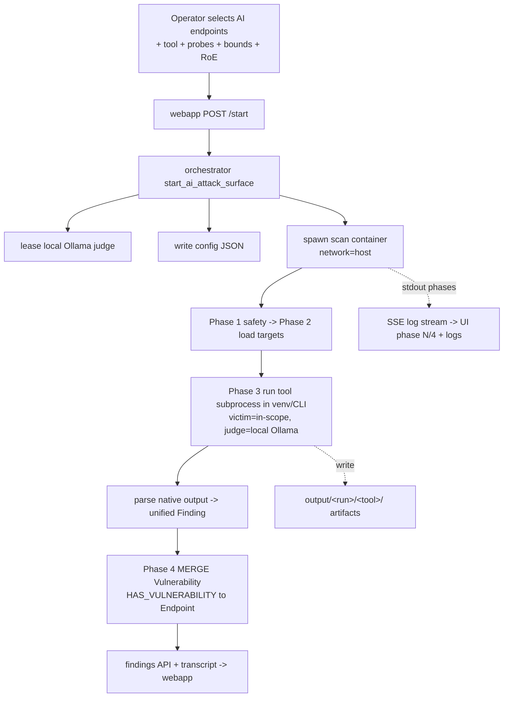

The whole subsystem is a thin, safe, deterministic bridge: **graph in** (the AI
endpoints recon found) → **a real adversarial tool run** (in an isolated venv,
against the live target, graded by a local model) → **graph out** (normalized
`Vulnerability` findings on the same nodes), with live progress, full operator
control over targets/probes/bounds, and on-disk proof the operator can inspect.
