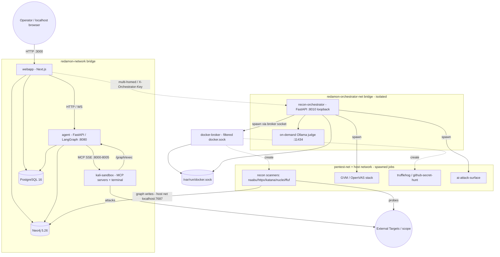
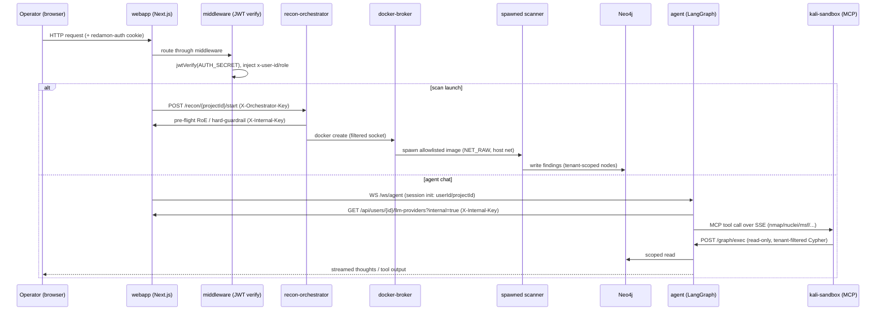
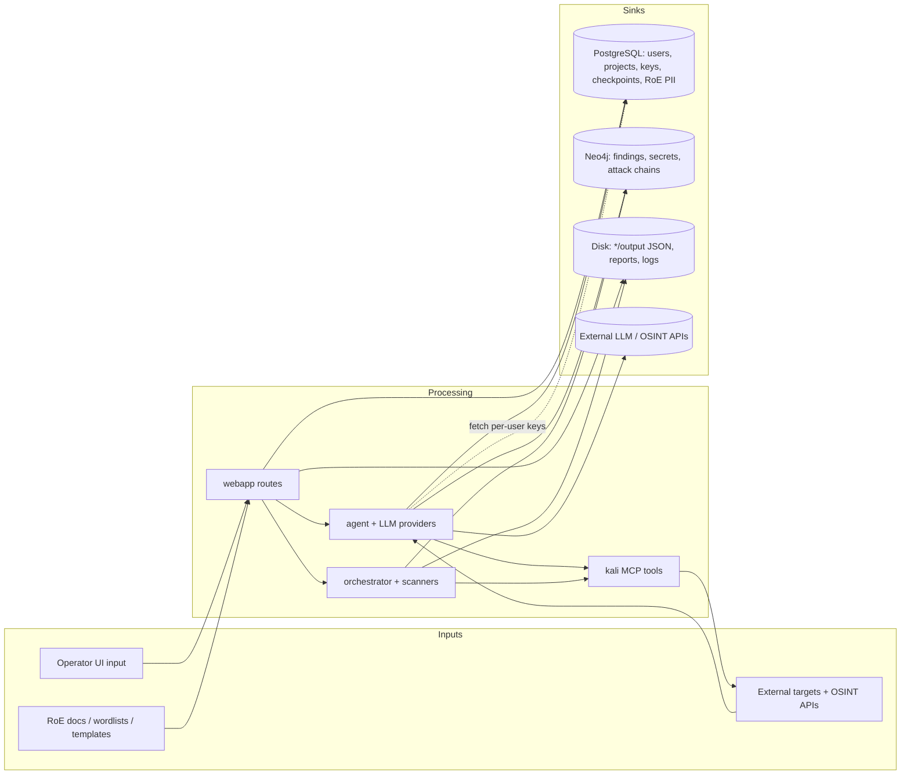
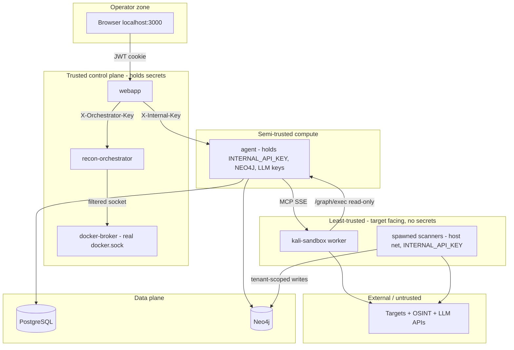

# RedAmon Threat Model

> **Scope of this document:** System overview, assets, architecture, data flow, trust boundaries, entry points, and the full network surface — describing the **current state of fact** of the deployed system. Every statement below is grounded in repository evidence (source, Dockerfiles, `docker-compose.yml`, Prisma/Neo4j schemas, config).
>
> **Deployment postures:** RedAmon supports two deployment postures, and the trust model differs between them:
>
> - **Local (default).** Single host, Docker Compose, driven by `redamon.sh`. Host-published ports are reachable on the operator's machine/LAN, not the internet. The base `docker-compose.yml` binds `webapp:3000`, `agent:8090`, and the reverse-shell catcher `4444` on `0.0.0.0` (LAN-reachable); the datastores, MCP servers, and orchestrator are bound to `127.0.0.1`. There is no anonymous-internet-attacker actor in this posture, and several app-layer weaknesses (unauthenticated agent endpoints that trust body-supplied identity, no login lockout, secrets that fail *open* when unset) are only reachable from the LAN.
> - **Public-internet (hardened).** Provisioned by `deploy/single-host/deploy.sh`, which wraps the same stack in an internet-facing security layer that `redamon.sh` deliberately does not provide (see `deploy/single-host/README.md`). It re-binds `webapp:3000` and `agent:8090` to `127.0.0.1`, keeps `4444` on loopback (opened via `ufw` to engagement-target CIDRs only, per-engagement), and puts **nginx as the single public origin on `443`** (TLS-terminated) reverse-proxying the webapp and **only the four agent `/ws/*` paths** under one origin. The agent's REST surface is never proxied. An operator-IP allowlist (nginx `allow`/`deny` + `ufw`), login rate-limiting, HSTS, fail2ban, SSH hardening, and a secrets-strength gate compensate for the local-only assumptions above. **This posture adds an anonymous internet attacker as a first-class actor**, and the deploy layer's role is to ensure only the TLS webapp origin (plus the allowlisted agent WS paths) is reachable, with every other port/endpoint closed or funneled.
>
> The structure below describes the **local** posture; each network entry point notes how the public-internet layer changes its exposure.

**Project version:** 5.5.0 (`VERSION`)

## Table of Contents

1. [System Overview](#system-overview)
2. [Assets](#assets)
3. [Architecture & Data Flow](#architecture--data-flow)
4. [Trust Boundaries](#trust-boundaries)
5. [Entry Points](#entry-points)
6. [Network Surface (Local vs Public-Internet)](#network-surface-local-vs-public-internet)

---

## System Overview

**RedAmon** is a self-hosted, AI-driven **offensive security / red-team automation platform**. An operator defines an engagement (target scope + Rules of Engagement), launches automated **reconnaissance**, **vulnerability scanning**, and **secret hunting**, then drives an **LLM agent** (single agent or multi-agent "fireteam") that reasons over the findings and executes offensive tooling (nmap, nuclei, metasploit, hydra, playwright, ffuf, etc.) inside a sandboxed Kali container. Results are stored in a multi-tenant graph and surfaced through a Next.js web UI.

**Primary data types handled:**
- Engagement configuration and **Rules of Engagement** (target domains/IPs, scope exclusions, client contact details, time windows, allowed phases) — `Project` model, ~750 lines.
- **Reconnaissance findings** (subdomains, IPs, ports, services, technologies, endpoints, certificates, DNS) in Neo4j.
- **Discovered secrets / leaked credentials** (TruffleHog + GitHub secret hunt) stored as graph nodes and JSON artifacts.
- **Vulnerability data** (Nuclei, GVM/OpenVAS, CVE/CAPEC/MITRE enrichment).
- **Third-party credentials**: per-user LLM provider API keys and ~35 recon/OSINT service API keys.
- **Agent execution state** (LangGraph checkpoints: prompts, tool outputs, exploitation artifacts).

### Technology Stack

| Layer | Technology (evidence) |
|-------|-----------------------|
| Frontend / Web | **Next.js 16** (App Router), **React 19**, TypeScript, TanStack Query/Table, xterm.js, react-force-graph / `@xyflow/react`, Recharts (`webapp/package.json`) |
| Web auth | **JWT (HS256)** via `jose`, **bcryptjs** (12 rounds) password hashing, httpOnly cookie `redamon-auth` (`webapp/src/lib/auth.ts`, `webapp/src/middleware.ts`) |
| Relational DB | **PostgreSQL 16** via **Prisma ORM 6** (`webapp/prisma/schema.prisma`, push-based workflow) |
| Graph DB | **Neo4j 5.26 Community** + APOC plugin; bolt protocol (`docker-compose.yml`) |
| AI agent | **Python / FastAPI / Uvicorn**, **LangGraph + LangChain**, LangGraph Postgres checkpointer (`agentic/`) |
| LLM providers | OpenAI, Anthropic, Google Gemini, AWS Bedrock, OpenRouter, DeepSeek, Mistral, XAI, Qwen, GLM, Kimi, plus OpenAI-compatible / Ollama-local custom (`agentic/orchestrator_helpers/model_providers.py`) |
| Recon orchestration | **Python / FastAPI**, **Docker SDK** (`recon_orchestrator/`) — spawns scan containers |
| Offensive tooling (MCP) | **Kali sandbox** exposing **MCP servers over SSE**: network-recon, nmap, nuclei, metasploit, playwright; plus interactive terminal + tunnel manager (`mcp/servers/`) |
| Privilege separation | **docker-broker** — filtering reverse proxy for the Docker socket (`docker_broker/`) |
| Vuln scanning | **GVM / OpenVAS** (Greenbone community feed stack, `gvmd`/`ospd-openvas`) |
| Secret scanning | **TruffleHog**, **GitHub secret hunt** containers |
| AI surface testing | Local **Ollama** judge/attacker (qwen2.5:7b default), garak/PyRIT/giskard/promptfoo (`ai_attack_surface_scan/`) |
| Knowledge Base | Optional NVD / ExploitDB / Nuclei / GTFOBins / LOLBAS ingestion + embeddings (`knowledge_base/`) |
| Code fixing (CodeFix) | LLM CodeFix/Triage agents cloning GitHub repos and opening PRs (`agentic/cypherfix_*`); **CodeFix build/test commands run in an ephemeral, secret-free, network-isolated sandbox container** (`codefix_sandbox/`, spawned per job) — not in the agent |

### Deployment Architecture

All services run as containers on a single Docker host across **three bridge networks** (`redamon-network`, `redamon-orchestrator-net`, `pentest-net`) plus selected containers on the **host network**. The privileged orchestrator API is bound to **host loopback only** (`127.0.0.1:8010`).

**Public-internet topology (via `deploy/single-host/`).** When deployed publicly, an **nginx reverse proxy terminates TLS on `443`** and is the only listener reachable from the internet. It proxies `/` and `/api/*` to the loopback-bound webapp (`127.0.0.1:3000`) and the four agent WebSocket paths (`/ws/agent`, `/ws/kali-terminal`, `/ws/cypherfix-triage`, `/ws/cypherfix-codefix`) to the loopback-bound agent (`127.0.0.1:8090`); the agent's REST endpoints are never proxied. Port `80` serves only the ACME challenge and a redirect to `443`. `ufw` default-denies inbound except `443` (and `22`/`443` from the operator CIDR); the Docker loopback re-binds are the primary control for `3000`/`8090` (ufw is belt-and-braces, since Docker's own iptables chains can bypass it). The bridge networks and the orchestrator loopback bind are unchanged from the local posture. Because `NEXT_PUBLIC_AGENT_WS_URL` is baked at build time, the webapp is rebuilt with a same-origin `wss://<domain>/ws/…` so the browser never targets `:8090` directly.

---

## Assets

### 1. Critical Assets

| Asset | Type | Sensitivity | Impact if Compromised |
|-------|------|-------------|------------------------|
| User password hashes (`users.password`, bcrypt) | Auth data | **CRITICAL** | Operator account takeover |
| `AUTH_SECRET` (JWT signing key) | Cryptographic key | **CRITICAL** | Session forgery / full UI auth bypass |
| LLM provider API keys (`user_llm_providers`: `apiKey`, `awsAccessKeyId`, `awsSecretKey`, `awsBearerToken`) | Credentials | **CRITICAL** | Cloud/LLM billing abuse, lateral cloud access |
| ~35 OSINT/recon service keys (`user_settings`: Shodan, Censys, VirusTotal, GitHub token, FOFA, Tavily, ngrok, etc.) | Credentials | **CRITICAL** | Third-party account abuse, data leakage |
| Discovered secrets in graph (`GithubSecret`, `TrufflehogFinding`, `Secret` nodes) | Harvested credentials | **CRITICAL** | Target compromise; secondary breach |
| Neo4j credentials (`NEO4J_PASSWORD`) | DB credential | **CRITICAL** | Full read/write of all engagement findings |
| `INTERNAL_API_KEY` / `ORCHESTRATOR_API_KEY` | Service auth tokens | **CRITICAL** | Inter-service impersonation / scan orchestration |
| GitHub access token (CodeFix agent, `cypherfix_codefix/tools/github_repo.py`) | Credential | **CRITICAL** | Push/PR to operator repos. Now supplied to git via `GIT_ASKPASS` (never embedded in the clone/push URL or `.git/config`) and **never injected into the build sandbox** |
| Rules of Engagement & client PII (`Project.roeClientContactEmail/Phone`, scope, exclusions) | Engagement data | **HIGH** | Legal/scope breach; out-of-scope attacks |

### 2. Important Assets

| Asset | Type | Sensitivity | Notes |
|-------|------|-------------|-------|
| LangGraph checkpoints (`checkpoints`, `checkpoint_blobs`, `checkpoint_writes`) | Agent state | HIGH | Hold prompts, tool outputs, exploitation artifacts |
| Recon/GVM/secret-scan JSON artifacts (`*/output/*.json`) | Scan output | HIGH | Full target metadata, vuln evidence, found secrets |
| Conversations & chat messages (`conversations`, `chat_messages`) | Engagement logs | MEDIUM | Tool outputs, agent reasoning |
| Reports (`reports`, `report_data` volume) | Generated deliverables | MEDIUM | Aggregated findings |
| Fireteam member state (`fireteam_members.resultBlob`, `errorMessage`) | Multi-agent state | MEDIUM | Exploitation results per member |
| Agent / orchestrator logs (`agentic/logs`) | Logs | MEDIUM | May contain tokens/target detail |

### 3. Infrastructure Assets

| Asset | Type | Notes |
|-------|------|-------|
| Host Docker daemon socket (`/var/run/docker.sock`) | Host control plane | Held by orchestrator + docker-broker; root-equivalent |
| Docker volumes (`postgres_data`, `neo4j_data`, `redamon_llm_models`, GVM feed volumes, `report_data`, `js_recon_*`) | Persistent storage | Hold DBs, models, uploads, reports |
| Kali sandbox container | Offensive tool runtime | Holds raw network caps (`NET_RAW`, `NET_ADMIN`), `seccomp:unconfined` |
| GVM/OpenVAS stack | Vuln scanner | `ospd` runs `seccomp/apparmor=unconfined`, `NET_ADMIN`/`NET_RAW` |
| On-demand Ollama LLM container | Local inference | Spawned per AI-surface scan; isolated net |
| Bridge networks (`redamon`, `orchestrator-net`, `pentest-net`) | Network segmentation | Trust-zone separation |

### 4. Other Assets

| Asset | Type | Notes |
|-------|------|-------|
| Uploaded wordlists (`recon/wordlists`, ≤50 MB `.txt`) | User input | Mounted into recon containers |
| Uploaded Nuclei templates (`mcp/nuclei-templates`, ≤1 MB `.yaml`) | User input | Executed by Nuclei |
| Uploaded JS recon files (`js_recon_uploads/custom`, ≤10 MB) | User input | Analyzed by JS recon |
| RoE documents (`Project.roeDocumentData` bytes; PDF/DOCX/TXT) | User input | Parsed via pdfjs/mammoth → LLM |
| Agent/community Chat Skills & Attack Skills (`agentic/skills`, `community-skills`, DB) | Behavior definitions | Steer agent tradecraft |
| Knowledge Base data (`knowledge_base/data`, `kb_data` volume) | Reference corpus | NVD/ExploitDB/Nuclei/GTFOBins embeddings |

---

## Architecture & Data Flow

### Request Flow

Operator → Next.js webapp (cookie-auth + middleware) → server-side API routes fan out to backend services with service tokens. The privileged orchestrator is reachable **only** by the webapp (loopback + dedicated network), never by the worker.

### Data Flow Diagram

Sensitive data sources, processors, and sinks identified in the repository:

**Notable flows:**
- **Per-user LLM/OSINT keys** travel webapp DB → agent at runtime via `GET /api/users/{id}/llm-providers?internal=true` authenticated with `X-Internal-Key` (`INTERNAL_API_KEY`).
- **Found secrets** flow target → secret scanners → Neo4j (`GithubSecret`/`TrufflehogFinding`/`Secret`) and `*/output/*.json` on disk.
- **Graph reads from the worker** are funneled through `agent /graph/exec`, which enforces read-only + tenant scoping; the worker holds no Neo4j credentials.
- **Outbound to external LLM/OSINT providers** carries prompts, target context, and operator-supplied keys off-host.

---

## Trust Boundaries

RedAmon implements explicit, code-level privilege separation. The design intent (documented inline in `docker-compose.yml` and `recon_orchestrator/auth.py`) is that the **target-facing worker is the least trusted** component and holds **no secrets**.

### Boundary Controls Summary

| Boundary crossing | Control observed (structural) | Residual exposure |
|-------------------|-------------------------------|-------------------|
| Browser → webapp | JWT (HS256) in httpOnly cookie; `middleware.ts` verifies + injects `x-user-id`/`x-user-role`; public-path allowlist | `AUTH_SECRET`/keys default to `changeme` if unset |
| webapp → orchestrator | `X-Orchestrator-Key`, constant-time `hmac.compare_digest`; fail-closed; orchestrator bound to `127.0.0.1` + isolated network | Single shared static key |
| webapp/agent → service APIs | `X-Internal-Key` (`INTERNAL_API_KEY`) header; as of wave 2 `/graph/exec` and `/emergency-stop-all` also require `require_internal_auth` (a valid `INTERNAL_API_KEY`/scoped `SCANNER_API_KEY`) | Tenant identity in the body of `/graph/exec` is now dual-mode (accepted and logged) pending the R12 enforce flip |
| orchestrator → Docker daemon | **docker-broker** filters `create`: image allowlist, denies `--privileged`, host-root binds, docker.sock mount, dangerous caps/namespaces, `unconfined` | Broker is sole guard for host-root-equivalent socket |
| worker → graph | `/graph/exec` requires `require_internal_auth`; the worker now presents the scoped `SCANNER_API_KEY` (never a master secret); write Cypher blocked (regex, now incl. `apoc.atomic.*`) + `user_id`/`project_id` tenant filter injected; worker holds no Neo4j creds | Tenant identity is authenticated at the caller but the body-supplied tenant is still dual-mode (logged), not yet enforced |
| spawned scanner → host | Host network + `NET_RAW`; mounts the **broker** socket, not raw socket; capability-restricted | Scanners do hold `INTERNAL_API_KEY` |
| platform → targets/LLMs | Hard guardrail (`.gov/.mil/.edu/.int` + ~310 intergovernmental domains, non-disableable) + LLM soft guardrail + RoE time-window pre-flight | Soft guardrail is LLM-based ("be lenient"); fails open |
| DBs | PostgreSQL/Neo4j on bridge net with credentials | Secrets stored plaintext at rest in `user_settings`/`user_llm_providers` |

**Public-internet posture adds a boundary in front of the browser→webapp crossing:** nginx on `443` becomes the outermost trust boundary. It supplies the login rate-limit the app lacks (`limit_req` on `/api/auth/login`, the only brake since there is no account lockout), an operator-IP allowlist (`allow`/`deny`) or basic-auth gate, TLS + HSTS, and slowloris/DoS timeouts; a deploy-time secrets-strength gate refuses to boot with `changeme`/unset/short secrets, closing the "keys default to `changeme`" residual for that posture. The agent's REST endpoints stay behind the boundary because nginx proxies only the four `/ws/*` paths; as of wave 2 `/graph/exec` and `/emergency-stop-all` also require `require_internal_auth` (the `/workspace/*` routes remain body-identity, still loopback/bridge-only). All four `/ws/*` paths now **fail closed** when `AGENT_WS_TICKET_SECRET` is unset (no more ticket fail-open), so the former WS-ticket residual is closed at the app layer and the secrets gate is defense-in-depth rather than the sole control.

---

## Entry Points

### 1. Network Entry Points

Host-published listeners (from `docker-compose.yml`), shown for the **local** posture; bindings without an explicit `127.0.0.1` default to `0.0.0.0` and are reachable on the host LAN. In the **public-internet** posture (`deploy/single-host/`) the `0.0.0.0` rows below are re-bound to `127.0.0.1` and fronted by nginx on `443`; the *Exposure* column notes the delta.

| Entry Point | Service | Protocol | Host Port | Access Control | Exposure |
|-------------|---------|----------|-----------|----------------|----------|
| Web UI / API | webapp | HTTP | `3000` | JWT cookie + middleware | LAN (0.0.0.0) local; **public: `127.0.0.1`, only nginx `443` (TLS) exposed** |
| Agent API / WS | agent | HTTP/WS | `8090→8080` | Mixed; all four `/ws/*` paths ticket + origin gated (wave 2), `/graph/exec` + `/emergency-stop-all` require `require_internal_auth`; some REST routes remain body-identity | LAN (0.0.0.0) local; **public: `127.0.0.1`, nginx proxies only the four `/ws/*` paths; REST unreachable** |
| Recon orchestrator | recon-orchestrator | HTTP | `127.0.0.1:8010` | `X-Orchestrator-Key` | **Loopback only** |
| PostgreSQL | postgres | TCP | `127.0.0.1:5432` | DB password (generated on fresh install) | **Loopback only** (2026-07-05) |
| Neo4j HTTP / Bolt | neo4j | HTTP/Bolt | `127.0.0.1:7474` / `7687` | DB password (generated on fresh install) | **Loopback only** (2026-07-05) |
| MCP network-recon | kali-sandbox | SSE/HTTP | `127.0.0.1:8000` | Bearer `MCP_AUTH_TOKEN` | **Loopback only** (2026-07-05) |
| MCP nuclei | kali-sandbox | SSE/HTTP | `127.0.0.1:8002` | Bearer `MCP_AUTH_TOKEN` | **Loopback only** |
| MCP metasploit | kali-sandbox | SSE/HTTP | `127.0.0.1:8003` | Bearer `MCP_AUTH_TOKEN` | **Loopback only** |
| MCP nmap | kali-sandbox | SSE/HTTP | `127.0.0.1:8004` | Bearer `MCP_AUTH_TOKEN` | **Loopback only** |
| MCP playwright | kali-sandbox | SSE/HTTP | `127.0.0.1:8005` | Bearer `MCP_AUTH_TOKEN` | **Loopback only** |
| MSF / Hydra progress | kali-sandbox | HTTP | `127.0.0.1:8013` / `8014` | None (loopback + agent-internal) | **Loopback only** (2026-07-05) |
| Tunnel manager | kali-sandbox | HTTP | `127.0.0.1:8015` | Push-config trigger (loopback) | **Loopback only** (2026-07-05) |
| Interactive terminal WS | kali-sandbox | WS | `127.0.0.1:8016` | Init-frame tenant ctx | **Loopback only** |
| Reverse-shell / ngrok | kali-sandbox | TCP/HTTP | `4444` / `127.0.0.1:4040` | None | 4444 LAN (direct reverse shells) local; **public: `127.0.0.1`, `ufw`-opened to target CIDRs per engagement**; 4040 loopback |
| Ollama judge (on-demand) | local-llm | HTTP | `11434` | None | Spawned per scan |
| GVM (gvmd/ospd) | GVM stack | Unix socket | n/a | Socket + GVM `admin/admin` | Internal only (no host port) |

### 2. Application Entry Points

Webapp server-side routes under `webapp/src/app/api/` (all behind `middleware.ts` except the public allowlist). Authentication present unless noted.

| Route group | Examples | Auth / validation |
|-------------|----------|-------------------|
| Auth | `/api/auth/login`, `/logout`, `/me` | Public login; bcrypt compare → JWT cookie |
| Public allowlist | `/api/health`, `/api/version/check`, `/api/global/tunnel-config/sync` | **Unauthenticated by design** |
| Scan orchestration | `/api/recon|gvm|trufflehog|github-hunt|ai-attack-surface/[projectId]/*` (start/stop/status/logs) | JWT; proxied with `X-Orchestrator-Key` |
| Agent | `/api/agent/command-whisperer`, `/api/agent/sessions/*`, `/api/agent/workspace/*` | JWT; agent proxy (no auth header to agent) |
| Graph | `/api/graph`, `/api/graph-views/*` | JWT; Neo4j basic auth server-side |
| LLM / models | `/api/users/[id]/llm-providers`, `/api/models` | JWT; `?internal=true` returns **unmasked** keys |
| Settings | `/api/users/[id]/settings` | JWT; ~35 OSINT keys (masked on read) |
| Reports / analytics | `/api/reports/*`, `/api/analytics/redzone/*`, `/api/projects/[id]/reports` | JWT |
| **File uploads** | `/api/projects/[id]/wordlists` (≤50 MB `.txt`), `/api/nuclei-templates` (≤1 MB `.yaml`), `/api/js-recon/[projectId]/upload` (≤10 MB), `/api/roe/parse` (≤20 MB PDF/DOCX → LLM) | JWT; extension allowlist + `path.basename` sanitization |
| Projects | `/api/projects/*` (CRUD, import/export, presets) | JWT |

**Agent service (`agentic/api.py`) endpoints**, reachable on `:8090`. As of wave 2 all four `/ws/*` paths require a signed ws-ticket + a server-side same-origin check (fail-closed when `AGENT_WS_TICKET_SECRET` is unset), and `/graph/exec` + `/emergency-stop-all` require `require_internal_auth`; the remaining REST helpers still derive user/project identity from the request body. In the local posture the whole surface is LAN-reachable. In the public posture nginx exposes **only** the four `/ws/*` paths (all ticket + origin gated); every REST route below is never proxied and stays loopback-only:
- `WS /ws/agent` (session init), `WS /ws/kali-terminal` (PTY proxy)
- `POST /graph/exec` (read-only tenant-filtered Cypher), `POST /emergency-stop-all`
- `POST /mcp/reload|test`, `GET /mcp/manifest`, `POST /llm-provider/test`
- `POST /roe/parse`, `POST /api/report/summarize`, `POST /guardrail/check-target`
- `POST /llm/{ffuf-extensions,nuclei-tags,waf-classify,nuclei-fp-filter,takeover-classify}`
- `GET /health`, `GET /defaults`, `POST /models`, `/workspace/*`, `/sessions/*`

**Orchestrator service (`recon_orchestrator/api.py`)** — loopback `:8010`, every route except `/health` requires `X-Orchestrator-Key`:
- `POST /recon/{project_id}/{start,stop,pause,resume}`, `GET .../status,logs`, `/recon/{project_id}/partial`
- `/gvm/...`, `/github-hunt/...`, `/trufflehog/...`, `/ai-attack-surface/{project_id}/...`
- `/local-llm/{status,ensure,release}`, `DELETE /recon/{project_id}/data`, `POST /project/{id}/artifacts/{type}`

### 3. Background Entry Points

| Mechanism | Trigger | Notes |
|-----------|---------|-------|
| Spawned scan containers | Orchestrator on scan launch | Ephemeral recon/gvm/secret/ai-surface jobs via docker-broker; host network |
| On-demand Ollama judge | AI-attack-surface scan launch | Ref-counted lease; torn down at zero leases (`local_llm_manager.py`) |
| KB-refresh sidecar | `--profile kb-refresh`, opt-in | Sleep-loop scheduler: daily NVD, weekly ExploitDB/Nuclei, monthly GTFOBins/LOLBAS (`docker-compose.yml`) |
| MSF / Nuclei auto-update | `MSF_AUTO_UPDATE` / `NUCLEI_AUTO_UPDATE` env on kali boot | Pulls external content into the worker |
| Tunnel-config sync | Worker boot → webapp push to `:8015` | Worker calls unauthenticated `/api/global/tunnel-config/sync`; webapp pushes config |
| CodeFix / Triage agents | Operator-initiated code fix | Clone GitHub repo (token via `GIT_ASKPASS`); **build/test (`github_bash`) runs in an isolated per-job sandbox** via `docker exec` (agent → webapp → orchestrator), not in the agent; commit stages **only approved files** (no `git add -A`); push refused to default/`main`/`master` (`cypherfix_codefix/`, `codefix_sandbox/`) |
| LangGraph checkpointer | Every agent/fireteam step | Persists agent state to PostgreSQL (`PERSISTENT_CHECKPOINTER=true`) |

---

## Network Surface (Local vs Public-Internet)

Consolidated view of the full network surface and how traffic is mediated in each posture. This is a description of the **current state of fact** — where each listener binds, how nginx routes public traffic in the deploy posture, and how the containers reach one another internally.

### 6.1 Posture summary

- **Local (default `redamon.sh` / `docker compose`).** No nginx, no TLS, no gate. The host publishes `webapp:3000`, `agent:8090`, and `kali:4444` on `0.0.0.0` (LAN-reachable); every other listener binds `127.0.0.1` (loopback). The browser talks to the webapp on `:3000` and opens agent WebSockets directly on `:8090`.
- **Public-internet (`deploy/single-host/`).** nginx on the host terminates TLS on `443` and is the single public origin. The prod overlay re-binds `webapp:3000` and `agent:8090` to `127.0.0.1`; the browser reaches everything through `443`. `NEXT_PUBLIC_AGENT_WS_URL` is baked at build time to `wss://<domain>/ws/agent`, so the browser never targets `:8090` directly.

> **nginx is a host service, not a container.** It runs on the host (installed by `deploy.sh` via apt), sits **only at the edge** (80/443), and reverse-proxies to two loopback backends — the webapp (`127.0.0.1:3000`) and the agent (`127.0.0.1:8090`). It is **not** a middlebox between containers: all internal service-to-service traffic (webapp ↔ agent ↔ orchestrator ↔ DBs ↔ Kali) flows directly over the Docker bridge networks and never passes through nginx.

### 6.2 nginx routing map (public-internet posture)

Rendered from `deploy/single-host/nginx/redamon.conf.tmpl`. These are the only `location` blocks; anything not listed has no route to a backend and is unreachable from the public origin.

| Listener | Location | → Backend | In-nginx control |
|----------|----------|-----------|------------------|
| `:80` | `/.well-known/acme-challenge/` | local webroot (`/var/www/certbot`) | ACME — **rendered only when `TLS_MODE=letsencrypt`**; absent for `provided`/`self-signed` |
| `:80` | everything else | — | `301` redirect to `https://` |
| `:443` | `/` and UI pages | webapp `127.0.0.1:3000` | operator gate + TLS |
| `:443` | `/api/auth/login` | webapp `127.0.0.1:3000` | `limit_req` 5/min (burst 3) |
| `:443` | `/api/` | webapp `127.0.0.1:3000` | `limit_req` 30/s (burst 60) |
| `:443` | `/ws/(agent\|kali-terminal\|cypherfix-triage\|cypherfix-codefix)` | agent `127.0.0.1:8090` | `auth_request` session gate (when `WS_REQUIRE_SESSION=true`) + `limit_conn` |
| `:443` | `= /_redamon_session` (internal) | webapp `127.0.0.1:3000/api/auth/me` | internal validator for `auth_request`; not directly reachable |

**The agent's REST surface is never proxied.** Only the four `/ws/*` paths reach `:8090`; `/graph/exec`, `/emergency-stop-all`, `/mcp/*`, `/llm/*`, `/workspace/*`, `/sessions/*`, etc. have no nginx route and stay loopback/bridge-only. The whole `:443` server sits behind the **operator gate** (`GATE_MODE`): `ip_allowlist` (nginx `allow`/`deny` from `OPERATOR_ALLOW_CIDRS`), `basic_auth` (htpasswd popup), or `none`.

### 6.3 nginx edge behaviors

Applied by nginx on the `:443` origin (`redamon.conf.tmpl` + `nginx/snippets/`):

- **Inbound header stripping** (`redamon-proxy-common.conf`): clears `X-Internal-Key`, `X-Scanner-Key`, `X-User-Id`, `X-User-Role` on every request (the webapp trusts these internally), pins `X-Forwarded-For`/`X-Real-IP` to the real peer, and hides `X-Powered-By`.
- **Security headers added** (the webapp sets none of its own): HSTS (`max-age=63072000; includeSubDomains; preload`), CSP (no `unsafe-eval`; `object-src 'none'`; `frame-ancestors 'none'`; `base-uri`/`form-action 'self'`), `X-Frame-Options DENY`, `X-Content-Type-Options nosniff`, `Referrer-Policy`, `X-Robots-Tag`.
- **TLS**: TLS 1.2/1.3 only, ECDHE ciphers, `ssl_session_tickets off`, OCSP stapling.
- **Rate/connection limits**: `limit_req` (login 5/min, api 30/s), `limit_conn 20`/IP, slowloris timeouts (`client_body/header_timeout 15s`, `keepalive_timeout 20s`), `large_client_header_buffers 8 32k`, `client_max_body_size 60m`.
- **Method filter**: only `GET/HEAD/POST/PUT/PATCH/DELETE/OPTIONS` (others → `405`).

### 6.4 Agent WebSocket endpoints

The four `/ws/*` paths, the feature each serves, the access control implemented in the agent, and the deploy-posture nginx gate in front:

| Path | Feature | App-layer auth (agent) | nginx gate (deploy) |
|------|---------|------------------------|---------------------|
| `/ws/agent` | Agent conversation (LLM, tools, approvals) | signed ws-ticket verified + server-side same-origin check; fail-closed (reject) when `AGENT_WS_TICKET_SECRET` unset; identity bound to verified ticket claims | session cookie (`auth_request`) |
| `/ws/kali-terminal` | Interactive Kali PTY (root shell) | signed ws-ticket verified at the agent proxy + same-origin check; fail-closed when secret unset; tenant env derived from verified claims, not the init frame | session cookie (`auth_request`) |
| `/ws/cypherfix-triage` | Vulnerability triage | signed ws-ticket verified + same-origin check; fail-closed when secret unset; identity from verified claims | session cookie (`auth_request`) |
| `/ws/cypherfix-codefix` | Code fixing + PR (GitHub token) | signed ws-ticket verified + same-origin check; fail-closed when secret unset; identity from verified claims | session cookie (`auth_request`) |

### 6.5 Local vs public-internet exposure matrix

Per-listener reachability in each posture (host publish → who can connect):

| Port | Service | Local (`docker compose`) | Public (`deploy/single-host/`) |
|------|---------|--------------------------|--------------------------------|
| `3000` | webapp | `0.0.0.0` — LAN | `127.0.0.1` — via nginx `443` only |
| `8090` | agent | `0.0.0.0` — LAN | `127.0.0.1` — nginx proxies only `/ws/*` |
| `4444` | reverse-shell catcher | `0.0.0.0` — LAN | `127.0.0.1` — `ufw`-opened per engagement |
| `8010` | recon-orchestrator | `127.0.0.1` | `127.0.0.1` |
| `5432` | PostgreSQL | `127.0.0.1` | `127.0.0.1` |
| `7474` / `7687` | Neo4j (HTTP / Bolt) | `127.0.0.1` | `127.0.0.1` |
| `8000/8002/8003/8004/8005` | Kali MCP servers | `127.0.0.1` | `127.0.0.1` |
| `8013` / `8014` | MSF / Hydra progress | `127.0.0.1` | `127.0.0.1` |
| `8015` | tunnel manager | `127.0.0.1` | `127.0.0.1` |
| `8016` | terminal PTY | `127.0.0.1` | `127.0.0.1` |
| `4040` | ngrok API | `127.0.0.1` | `127.0.0.1` |
| `80` / `443` | nginx | — (no nginx) | `0.0.0.0` — the public origin |

### 6.6 Cloud firewall / Security Group (public-internet posture)

`deploy.sh` configures the host `ufw`, but the cloud provider firewall (AWS Security Group / GCP firewall / Azure NSG) is the reliable outer boundary — Docker's own iptables chains can bypass `ufw`. Inbound rules:

| Port | Source | Purpose |
|------|--------|---------|
| `443/tcp` | operator CIDRs (or `0.0.0.0/0` behind the nginx gate) | the app (HTTPS) |
| `80/tcp` | `0.0.0.0/0` | ACME challenge + redirect to 443 |
| `22/tcp` | operator IP only | SSH management |

Nothing else is opened. `8090`, `3000`, the DB ports, and the Kali/MCP/tunnel/PTY ports are loopback-bound and reached only through nginx `443`; the browser reaches the agent WebSockets at `wss://<domain>/ws/…` (nginx → `127.0.0.1:8090`), so `8090` never needs to be publicly reachable.

### 6.7 Application paths reachable without a session (webapp)

The webapp middleware (`webapp/src/middleware.ts`) enforces the JWT cookie on every route except this allowlist, which is reachable without a login (still behind the operator gate in the deploy posture):

- `/login` (page)
- `/api/auth/login`, `/api/auth/logout`
- `/api/health`
- `/api/version/check`
- `/api/global/tunnel-config/sync`
- static assets (`/_next/*`, `/favicon*`, `/logo.png`, `/js_logo.png`)

Every other `/api/*` route requires a valid `redamon-auth` JWT cookie. The `X-Internal-Key` / `X-Scanner-Key` service headers (cleared by nginx at the edge) are accepted only from internal callers on the Docker network.

### 6.8 Internal segmentation (east-west)

Container-to-container traffic runs over three Docker bridge networks plus the host network; none of it passes through nginx.

| Network | Members | Purpose |
|---------|---------|---------|
| `redamon-network` | webapp, agent, kali-sandbox, postgres, neo4j | Main application plane |
| `redamon-orchestrator-net` | recon-orchestrator, webapp (multi-homed), on-demand Ollama | Isolated privileged orchestration |
| `pentest-net` | kali-sandbox, spawned scanners | Target-facing offensive plane |
| host network | spawned recon/gvm/secret scanners, reverse-shell catcher | Raw-socket scanning + direct reverse shells |

Notable internal reachability: the webapp is the only container multi-homed onto `redamon-orchestrator-net` (it holds `X-Orchestrator-Key`); the recon-orchestrator holds the Docker socket (via docker-broker for scanner spawns, and the real socket for GVM / CodeFix sandbox); the agent reaches the Kali MCP servers over `redamon-network`; spawned scanners write to Neo4j over the host network.

### 6.9 Egress (outbound)

Outbound connections leave the host to: external **LLM providers** (agent, per-user keys), ~35 **OSINT/recon APIs** (scanners), **scan targets** (Kali tools and recon probes, on the host network / `pentest-net`), **upstream feeds** (KB ingestion, MSF/Nuclei/image updates), and **tunnel edges** (ngrok cloud / chisel server) when `TUNNELS_ENABLED` and a tunnel is configured. The reverse-shell catcher (`4444`) accepts inbound from engagement targets only when opened per-engagement (`./deploy.sh revshell-open`).

---

*Generated from static analysis of the RedAmon repository. This document describes the current system structure and network surface (state of fact) only.*
