# Web Cache Poisoning (WCP) Recon Module - Technical Reference

This document explains, end to end, how RedAmon detects **web cache poisoning** and
**web cache deception**. It is written for an engineer who needs to understand,
operate, debug, or extend the module. It starts with the macro flow and then dives
into every component, data structure, and decision. All diagrams are Mermaid.

---

## 1. What the module does (one paragraph)

The module is an **active GROUP 6 vulnerability scanner**. Given the live URLs that
earlier recon stages discovered, it finds URLs that are served through a cache and
tests whether an attacker-controlled, *unkeyed* request component (a header, a query
parameter, or a path trick) can be smuggled into a **shared cache entry** and then
served to other visitors. Detection is a **two-engine pipeline**: the third-party
**WCVS** tool provides broad technique coverage (the "find suspects" half), and a
**RedAmon-native 5-phase confirmation engine** re-validates every suspect with a
safe, isolated baseline → poison → clean → persistence sequence (the "prove it" half).
Only findings that pass a confidence threshold become `Vulnerability` nodes in the
Neo4j attack-surface graph.

Core concept it exploits: a cache decides "have I seen this request before?" using a
**cache key** built from *some* request components (keyed) while ignoring others
(unkeyed). If the backend *uses* an unkeyed component to shape the response, an
attacker can poison the cached response for everyone. The module's whole job is to
find and safely prove that gap.

---

## 2. Macro flow

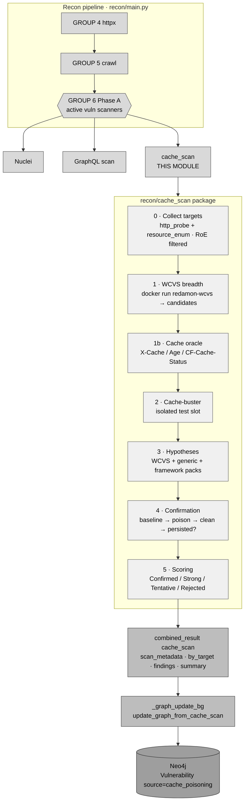

The module runs automatically as part of a full recon scan, and on demand via
**partial recon** (a single phase launched from the workflow graph).

---

## 3. Where it sits in the pipeline (and why)

It is registered in **GROUP 6 Phase A** of `recon/main.py` (the active
vulnerability-scanning fan-out), next to Nuclei and the GraphQL scanner:

```python
# recon/main.py - GROUP 6 Phase A
if _settings.get('WEB_CACHE_POISON_ENABLED', False):
    from recon.cache_scan import run_cache_scan_isolated
    phase_a_tools['cache_scan'] = run_cache_scan_isolated
```

It must run **late** because it depends on two products of earlier stages:

1. **Live URLs** - from `combined_result["http_probe"]["by_url"]` (GROUP 4 httpx) and
   `combined_result["resource_enum"]` (GROUP 5 crawling). You cannot test cache
   poisoning before you know which URLs are live.
2. **Technology fingerprint** - the framework hypothesis packs (Next.js, Nuxt, Remix)
   only fire when the recon fingerprint makes them plausible.

The fan-out uses the **isolated wrapper pattern**: each tool gets a deep copy of
`combined_result` so the parallel threads never race on the shared dict.

```python
def run_cache_scan_isolated(combined_result, settings):
    snapshot = copy.deepcopy(combined_result)
    run_cache_scan(snapshot, settings)        # mutates snapshot["cache_scan"]
    return snapshot.get("cache_scan", {})      # only this tool's payload is returned
```

The orchestrator merges the return value back as `combined_result["cache_scan"]` and
fires the graph update by method-name convention: `update_graph_from_{key}` →
`update_graph_from_cache_scan`.

---

## 4. The two engines, and why both exist

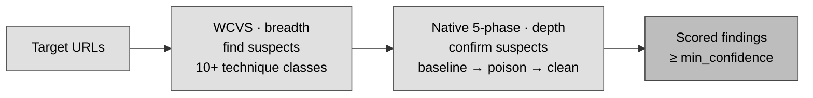

| | Engine | Role | Strength | Weakness |
|---|---|---|---|---|
| Phase 1 | **WCVS** (Hackmanit Web Cache Vulnerability Scanner, Go) | **Breadth** - find suspects | 10+ technique classes, crawler, deception, mature | High-noise; "vulnerable" needs re-proof |
| Phases 1b–5 | **RedAmon native** (Python) | **Depth** - confirm suspects | Precise, fingerprint-aware, integrated scoring/safety/graph; reflected **and** non-reflective (differential) detection | Single-shot poison (no concurrent race-winning) |

WCVS casts the wide net; the native layer turns "looks vulnerable" into a trustworthy,
scored finding. (CacheX was evaluated as an alternative confirmer; we built native for
tighter integration and zero new runtime dependency. See §15.)

---

## 5. The package layout

`recon/cache_scan/` - baked into the `redamon-recon` image (not volume-mounted), so
changes require `docker compose --profile tools build recon`.

| File | Responsibility |
|---|---|
| `__init__.py` | exports `run_cache_scan`, `run_cache_scan_isolated` |
| `scanner.py` | **orchestrator** - runs the 5 phases, owns target collection, RoE, caps, output assembly |
| `wcvs_runner.py` | **Phase 1** - build WCVS docker command, run it, parse the JSON report into candidates |
| `oracle.py` | **Phase 1b** - cache detection (hit/miss signal) |
| `buster.py` | **Phase 2** - find a safe, isolated cache-buster location |
| `hypotheses.py` | **Phase 3** - generate native test vectors (generic + framework packs) |
| `confirm.py` | **Phase 4** - the baseline→poison→clean→persistence sequence |
| `scoring.py` | **Phase 5** - confidence tiers + severity/CVSS mapping |
| `safety.py` | benign canaries, isolated-bucket helpers, CPDoS/deception gating |
| `normalizers.py` | shape findings into the `cache_scan` output structure |

Supporting code outside the package:
- `wcvs/Dockerfile` - builds `redamon-wcvs:latest` from WCVS source.
- `graph_db/mixins/cache_mixin.py` - `update_graph_from_cache_scan` (graph write).
- `recon/partial_recon_modules/cache_scanning.py` - partial-recon entry point.

---

## 6. Step-by-step: the scanner orchestrator (`scanner.py`)

`run_cache_scan(combined_result, settings)` is the entry point. It mutates
`combined_result` in place, adding `combined_result["cache_scan"]`.

### Step 0 - Gate and configure
- If `WEB_CACHE_POISON_ENABLED` is false, return immediately (no-op).
- Read runtime knobs: `WEB_CACHE_POISON_TIMEOUT_PER_REQ` (per-request timeout),
  `WEB_CACHE_POISON_VERIFY_SSL`, `WEB_CACHE_POISON_MIN_CONFIDENCE` (the gate),
  `WEB_CACHE_POISON_CROSS_VANTAGE`.

### Step 0a - Collect targets (`_collect_target_urls`)
Reuses the **same target builder Nuclei uses** (no duplicated logic):

```python
hostnames, ips, _ = extract_targets_from_recon(combined_result)
urls = build_target_urls(hostnames, ips, combined_result, scan_all_ips=False)
```

`build_target_urls` unions: (1) parameterized endpoint URLs from `resource_enum`,
(2) live BaseURLs from `http_probe`, (3) `http(s)://{hostname}` for any uncovered
host. Then **Rules of Engagement** filtering removes excluded hosts
(`_roe_excluded_hosts` reads `ROE_EXCLUDED_HOSTS` from settings or the recon
metadata block; `_host_excluded` matches exact host or any subdomain suffix).
Finally the list is capped at `_MAX_URLS = 200` so a huge surface cannot turn into a
runaway active scan.

### Step 0b - Build the HTTP session
`_build_retry_session()` returns a `requests.Session` with retry/backoff on
`429/500/502/503/504` (Cloudflare-fronted targets frequently 429 burst probes), GET
only, and a `RedAmon-CachePoison/1.0` User-Agent.

### The per-URL loop

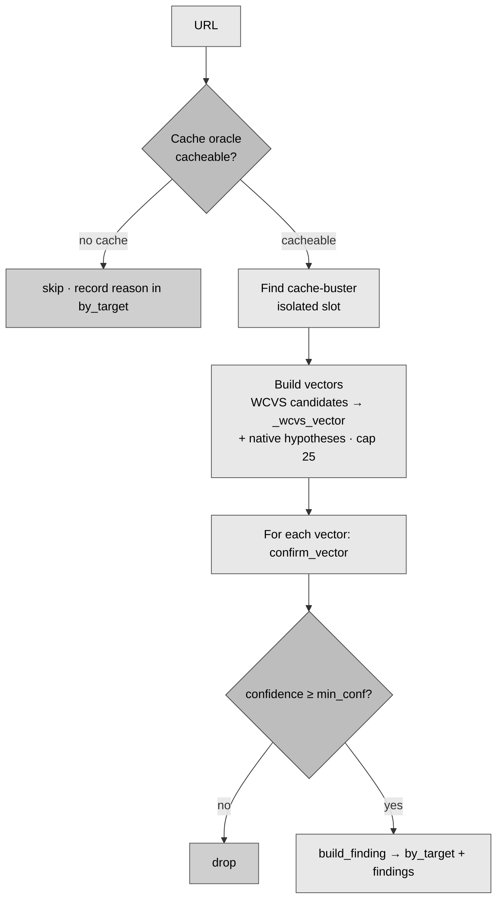

WCVS candidates are mapped to native vectors via `_wcvs_vector`, which chooses the
correct `vector_type`/`payload_kind`/`impact` from the WCVS technique so a *parameter*
or *deception* finding is re-tested faithfully and not forced through the header path.

**Parallelism.** The per-URL work above (`_scan_one_url`) is fanned out across a
bounded `ThreadPoolExecutor` (`WEB_CACHE_POISON_CONFIRM_WORKERS`, default 6). Each URL
is independent - every vector mints its own isolated cache-buster - so workers never
collide; each worker uses its own `requests.Session` (not thread-safe to share) and
returns its result, which the main thread merges (no shared-state mutation). The
4-request sequence inside one vector stays ordered. This is on top of the two outer
parallelism layers: the GROUP 6 fan-out (cache_scan runs concurrently with Nuclei /
GraphQL) and WCVS's own `-t` threads.

### Step final - Assemble output
`normalizers.build_cache_scan_result(scan_metadata, by_target, findings)` produces the
final structure (see §11). A one-line summary is printed and `combined_result["cache_scan"]`
is set.

---

## 7. Phase 1 - WCVS engine (`wcvs_runner.py`)

WCVS is run **docker-in-docker** (the recon container shells out to the host Docker
daemon), exactly like Nuclei/Katana.

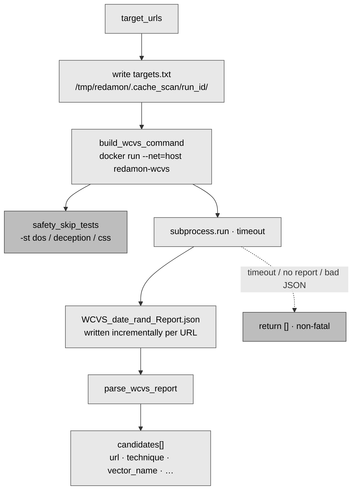

### The command (`build_wcvs_command`)

```
docker run --rm --net=host \
  -v <host targets dir>:/targets:ro \
  -v <host output dir>:/output \
  redamon-wcvs:latest \
  -u file:/targets/targets.txt \   # batch input: one URL per line
  -gr -gp /output/ \               # generate JSON report into /output
  -v 1 -t <concurrency> \          # verbosity, threads
  [-rr <rps>] [-ch <header>] \     # optional rate cap, custom cache header
  -stime \                         # skip time-based cache detection (FP-prone)
  [-st dos,deception,css]          # SAFETY skips (see below)
```

- `--net=host` so loopback/lab targets are reachable from the sibling container.
- `get_host_path()` translates `/tmp/redamon` container paths to host paths for the
  bind mounts.
- Targets and report live under `/tmp/redamon/.cache_scan/<run_id>/`; the directory is
  removed in a `finally` block.

### Safety: `-st` (skip tests)
`safety_skip_tests(allow_deception, allow_cpdos)` builds the WCVS `-skiptest` list:
- `allow_cpdos=False` (default) → adds `dos` (suppresses the oversized-header
  cache-poisoned-DoS test - verified live to be the `X-Oversized-Header-*` probes).
- `allow_deception=False` → adds `deception,css`.
The `safe-confirm` profile therefore never sends destructive payloads.

### Why `-stime`
Time-based cache detection (inferring caching from response-time deltas) is
false-positive prone. We always skip it and rely on header-based detection in the
native oracle.

### Report schema (`parse_wcvs_report`, matches `pkg/report.go`)

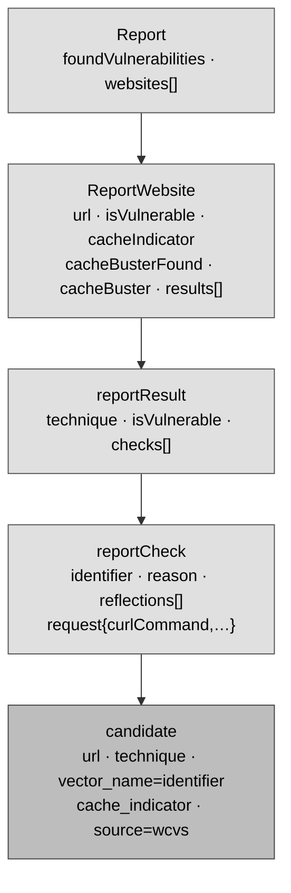

WCVS writes the report **incrementally** after every scanned URL (the package-global
`report` is re-serialized per website). So the file always exists and contains all
completed websites - on a timeout we parse the partial report gracefully. Only
`isVulnerable` websites and results are kept; each `check` becomes one candidate. Any
error returns `[]` (non-fatal; native hypotheses still run).

---

## 8. Phases 1b–5 - the native confirmation engine

### Phase 1b - Cache oracle (`oracle.py`)
`detect_cache_oracle(url, session)` issues up to three GETs (at least two, to catch a
MISS→HIT warm-up and caches that only store on a later request) and inspects headers
for a cache, with a behavioural fallback for silent caches:
- **Status headers** (carry a hit/miss token): `x-cache`, `cf-cache-status`,
  `x-cache-status`, `x-drupal-cache`, `x-varnish-cache`, `x-proxy-cache`,
  `x-cache-lookup` (Squid), `x-varnish` (numeric - two ids = a cache hit),
  `x-served-by`/`x-cache-hits` (Fastly), `x-iinfo` (Imperva). Tokens: `hit` →
  cached; `miss|expired` → cacheable; `stale|updating|revalidated` → served stale
  from cache (still cacheable); `dynamic|bypass|pass|uncacheable|no-cache` → cache
  **present but not caching this URL** (Cloudflare `dynamic` correctly does **not**
  count as cacheable).
- **Presence headers** (a cache/CDN layer exists): `via`, `surrogate-control`,
  `cdn-cache-control`, `cloudflare-cdn-cache-control`, `warning`, `x-cdn`.
- `age` header (positive → served from cache).
- `cache-control: public` / non-zero `max-age` → cache-eligible (unless
  `private`/`no-store`).
- `vary` → captured (which request headers are keyed), surfaced for downstream use.
- **Behavioural fallback (silent caches):** when no cache header is found, probe twice
  across a short delay and flag a cache if the origin `Date` is **frozen** and the body
  is identical (a cache replays the stored response with its original Date; a live
  origin advances it). This reads a server-generated header, so it is **not** the
  FP-prone response-time inference that WCVS `-stime` disables.

Returns `{cacheable, indicator, signals[], saw_hit, cache_layer, vary, behavioral}`.
**Not cacheable → the URL is skipped.** `response_cache_state(resp)` classifies a
single response as `hit | miss | unknown` and is reused in Phases 2 and 4.

### Phase 2 - Cache-buster placement (`buster.py`)
A cache buster is a unique value that forces the cache to treat the test request as a
**brand-new entry**, so the test never poisons the real cached page that live users
hit. This is a **safety control**, not just optimisation. `find_cache_buster` adds a
unique query param (default `rdmncb`), requests twice, and checks whether the query
string participates in the cache key. Every test gets a *fresh* buster value.

### Phase 3 - Hypotheses (`hypotheses.py`)
Two sources:
1. **Generic unkeyed headers** (always tried unless WCVS already tested them). The
   pack was widened from the CacheX payload list (ayuxdev/cachex, MIT) into families:
   - host spoof → `X-Forwarded-Host`, `X-Host`, `X-Forwarded-Server`, `X-Original-Host`,
     `X-Host-Override`, `X-Forwarded-Host-Override`, `X-HTTP-Host-Override`, `Forwarded`
   - scheme/proto → `X-Forwarded-Proto`, `X-Forwarded-Scheme`, `X-Original-Scheme`, `X-Url-Scheme`
   - port → `X-Forwarded-Port`
   - URL override → `X-Original-URL`, `X-Rewrite-URL`
   - client-IP → `X-Forwarded-For`, `X-Real-IP`, `True-Client-IP`, `X-Client-IP`

   Each header declares a `payload_kind`. **host/path/value** carry the benign
   `.invalid` canary (reflective). **scheme/port/ip** carry a fixed benign value
   (`https` / `443` / `127.0.0.1`) because they poison via *behaviour change*, not by
   echoing a marker - these are caught by the differential detector in Phase 4. The
   exotic CGI-style long tail (`HTTP_*`, `REMOTE_ADDR`, raw `CF-*` ids) is deliberately
   omitted to keep per-URL request load sane.
2. **Framework packs**, gated on the recon technology fingerprint:
   - Next.js → `x-invoke-status` (CPDoS via `/_error` render), `__nextDataReq`,
     `x-now-route-matches`, `Rsc`
   - Nuxt → `/_payload.json` path confusion
   - Remix / React Router → `_data`, `Host`/`X-Forwarded-Host` port confusion

   Packs only fire when the fingerprint matches and `WEB_CACHE_POISON_ALLOW_FRAMEWORK_PACKS`
   is true. Each hypothesis carries `vector_type` (`header|param|path`), `payload_kind`
   (`host|value|path`), and an `impact_hint`.

### Phase 4 - Behavioural confirmation (`confirm.py`)
This is the heart of the engine. For one vector, `confirm_vector` runs **all in one
isolated cache-buster slot**, using a **benign canary** (a non-resolving
`<token>.redamon-poc.invalid` host, or a plain token):

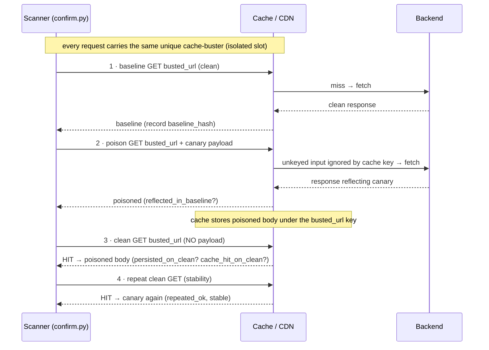

It records `reflected_in_baseline` (canary echoed in the poisoned response),
`persisted_on_clean` (the poison returned on the clean follow-up - the real proof),
`cache_hit_on_clean`, `repeated_ok`, `stable`, plus `evidence`
(`baseline_hash`, `poisoned_hash`, `clean_validation_hash`, `poc_link`, `curl_verify`,
`canary`, `cache_buster`). `_apply_vector` injects the payload by type (header →
request header; param → extra query param; path → appended path segment).
`classify_impact` resolves the concrete impact (a persisted payload in a redirect
`Location` → `open_redirect`).

**Two detection modes run together** (the second was ported natively from CacheX's
`detector.go`, ayuxdev/cachex, MIT - no Go dependency, no extra docker image):

- **Reflected** - the benign canary marker is echoed in body/redirect. Unambiguous
  proof; the only mode allowed to reach the `Confirmed` tier.
- **Differential (non-reflective)** - the poison changes the response *behaviour*
  (`Location` redirect, **status code**, or **body**) without echoing any marker.
  This catches the class the old reflection-keyed confirmer was blind to
  (CPDoS-style status flips, redirect/scheme poisoning, cache-key confusion serving a
  different body). Recorded as `differential_change` / `persisted_differential` /
  `detection_mode`; capped at `Strong` (never `Confirmed`) since a behavioural diff is
  inherently more coincidence-prone than a reflected marker.

**False-positive guard.** Differential mode issues **two** clean baselines first and
only trusts the response dimensions that were *identical* across both. A page whose
body flaps every request (timestamps, CSRF tokens) has its `body` dimension marked
untrusted, so it cannot raise a body-diff finding - `status`/`location` can still be
judged if they were stable. Toggle with `WEB_CACHE_POISON_DIFFERENTIAL` (default on);
when off, the engine reverts to the single-baseline reflected-only sequence.

> The decisive moment is step 3: **ask again as an innocent user, with no payload, and
> see the poison come back from cache** - whether that poison is a reflected canary or a
> persisted behavioural change. That is poisoning, proven.

### Phase 5 - Confidence scoring (`scoring.py`)

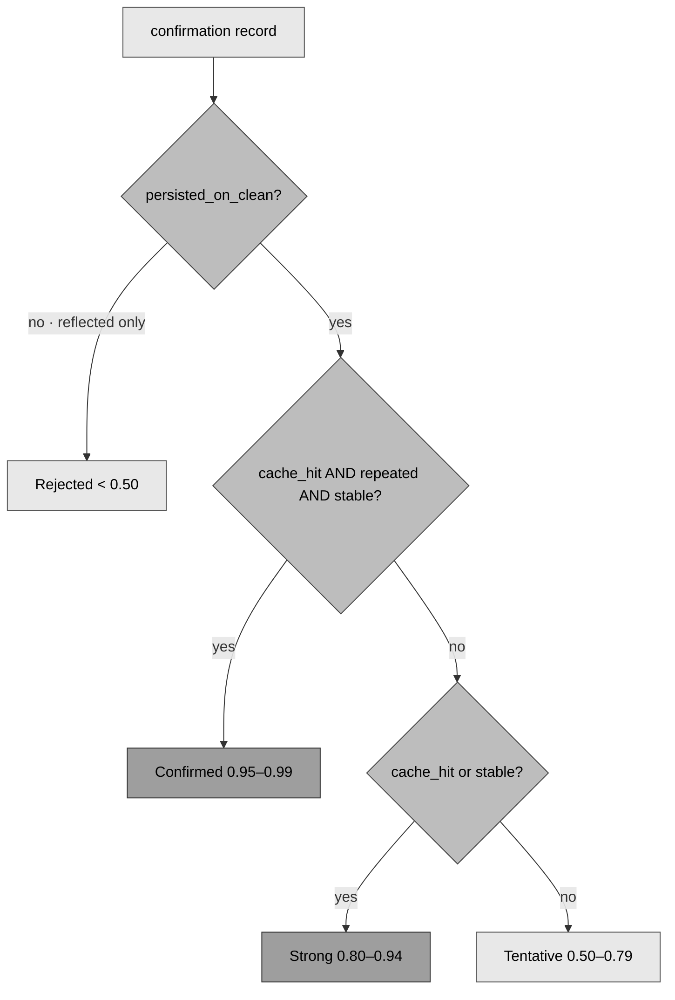

Only findings with `confidence ≥ WEB_CACHE_POISON_MIN_CONFIDENCE` (default 0.8 →
Confirmed + Strong) become real findings. `severity_for_impact` maps impact →
`(severity, cvss)`: stored_xss → critical/9.3, open_redirect → high/7.4, deception →
high/7.5, dos → high/7.5, reflected → medium/5.3.

---

## 9. Worked example (one Confirmed finding)

Target `https://shop.example/home`, Cloudflare-fronted, backend reflects
`X-Forwarded-Host` into a `<script src>`. Buster `?rdmncb=cb9f1a2b`, canary
`rdmn1a2b3c.redamon-poc.invalid`.

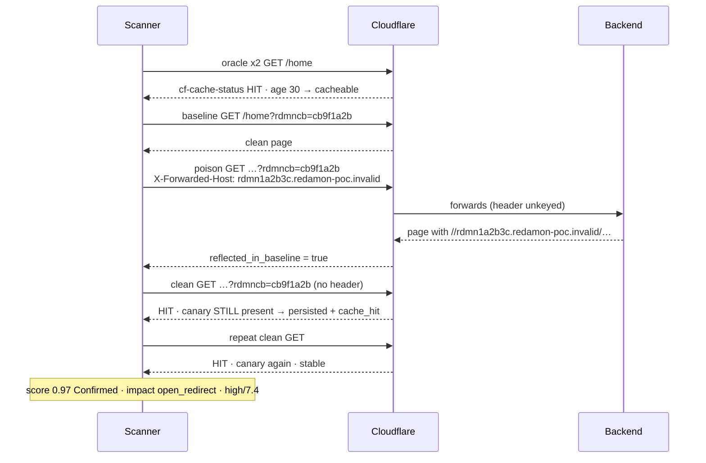

The canary never resolves, and the real `…/home` entry (no buster) was never touched.
Result: a `Vulnerability {source:"cache_poisoning", cache_header:"X-Forwarded-Host",
confidence_tier:"Confirmed", poc_link:"…/home?rdmncb=cb9f1a2b"}` linked to the Endpoint
and BaseURL.

---

## 10. Graph model (`graph_db/mixins/cache_mixin.py`)

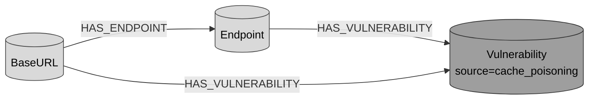

Findings reuse the shared **`Vulnerability`** node (no new label) with
`source="cache_poisoning"`. `update_graph_from_cache_scan` MERGEs the BaseURL/Endpoint
on the fly (so a finding whose endpoint wasn't crawled still lands in a connected
subgraph). Node id is deterministic and tenant-scoped so re-scans dedupe via MERGE:

```
cache_{user_id}_{project_id}_{technique}_{baseurl}_{path}_{vector}   (sanitised)
```

Persisted properties: `source`, `vulnerability_type="web_cache_poisoning"`, `name`,
`description`, `severity`, `cvss_score`, `confidence`, `confidence_tier`,
`cache_header`, `cache_param`, `cache_vector_type`, `cache_impact`, `cache_technique`,
`cache_buster`, `cache_signals[]`, `source_engine` (`wcvs`|`hypothesis`),
`cross_vantage`, `evidence` (JSON), and hoisted `poc_link` / `curl_verify`. A
`_check_unknown_keys` contract guard logs if the scanner ever emits a field the mixin
doesn't map (data-loss tripwire). The NL-to-Cypher prompt (`agentic/prompts/base.py`)
and `readmes/GRAPH.SCHEMA.md` document the `cache_poisoning` source.

Example Cypher (what the AI agent can run):
```cypher
MATCH (e:Endpoint)-[:HAS_VULNERABILITY]->(v:Vulnerability {source:'cache_poisoning'})
WHERE v.confidence_tier = 'Confirmed'
RETURN e.url, v.cache_header, v.cache_impact, v.confidence, v.poc_link
```

---

## 11. Output structure (`combined_result["cache_scan"]`)

```json
{
  "scan_metadata": {
    "scan_timestamp": "...", "duration_seconds": 12.3,
    "engine": "wcvs+native-confirm", "docker_image": "redamon-wcvs:latest",
    "scan_profile": "safe-confirm", "min_confidence": 0.8,
    "total_urls_scanned": 42, "cacheable_urls": 17, "wcvs_candidates": 5
  },
  "by_target": {
    "https://shop/home": { "oracle": {cacheable, indicator, signals, saw_hit},
                           "findings": [ ... ] }
  },
  "findings": [ {
    "endpoint_url": "https://shop/home", "technique": "unkeyed_header",
    "vector_type": "header", "cache_header": "X-Forwarded-Host", "cache_param": "",
    "impact": "open_redirect", "confidence": 0.97, "confidence_tier": "Confirmed",
    "severity": "high", "cvss_score": 7.4, "cache_signals": ["x-cache: hit","age: 12"],
    "cache_buster": "rdmncb=cb9f1a2b", "source_engine": "wcvs",
    "evidence": { "baseline_hash": "...", "poisoned_hash": "...",
                  "clean_validation_hash": "...", "poc_link": "...", "curl_verify": "..." }
  } ],
  "summary": { "total_findings": 1, "confirmed": 1, "strong": 0, "tentative": 0,
               "rejected": 0, "by_impact": {...}, "by_severity": {...},
               "urls_scanned": 42, "cacheable_urls": 17 }
}
```

Consumed by `graph_db/mixins/cache_mixin.py` (graph write) and
`webapp/src/lib/report/reportData.ts` (`queryWebCachePoison`, report section + risk
score).

---

## 12. Safety model (`safety.py`)

Web cache poisoning is an **active** test; a careless probe can poison a production
cache for real users. Controls, enforced centrally:

- **Benign canaries only** - markers are non-resolving (`.invalid` TLD), never live
  XSS or real attacker domains.
- **Isolated cache buckets** - every test carries a unique cache-buster, so it lands
  in its own slot and never the real entry.
- **Three scan profiles** (`WEB_CACHE_POISON_SCAN_PROFILE`):
  `safe-confirm` (production: benign, isolated, no CPDoS) · `extended` (owned test
  targets) · `research` (lab only; allows CPDoS if explicitly toggled).
- **CPDoS off by default** - `is_cpdos_allowed` requires *both* the `research` profile
  *and* `WEB_CACHE_POISON_ALLOW_CPDOS=true`.
- **Stealth mode disables the module entirely** (active, loud) - `apply_stealth_overrides`.
- **RoE-gated** - out-of-scope hosts filtered before any request.
- **Disabled by default** - `WEB_CACHE_POISON_ENABLED=false`.

---

## 13. Partial recon (`recon/partial_recon_modules/cache_scanning.py`)

The same engine can be launched for a single phase from the workflow graph.

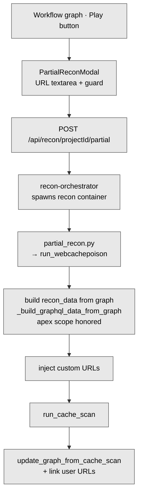

Key points: settings force-enable the module; targets come from the Neo4j graph
(BaseURLs + Endpoints) plus any custom URLs from the modal; the Include-Root-Domain
scope toggle (`_should_include_root_domain`) drops apex BaseURLs when root-domain scope
is off; dispatch is registered in `recon/partial_recon.py`
(`elif tool_id == "WebCachePoison"`).

---

## 14. Settings reference

Naming convention: `web_cache_poison_*` (DB column) → `webCachePoison*`
(Prisma/frontend) → `WEB_CACHE_POISON_*` (Python). Defined across Prisma schema,
`recon/project_settings.py` (defaults + mapping + stealth), and served via `/defaults`.

| Setting | Default | Meaning |
|---|---|---|
| `…_ENABLED` | `false` | Master toggle (active, opt-in) |
| `…_DOCKER_IMAGE` | `redamon-wcvs:latest` | WCVS image (locally built) |
| `…_SCAN_PROFILE` | `safe-confirm` | safe-confirm \| extended \| research |
| `…_TIMEOUT` | `1800` | WCVS subprocess timeout (s) |
| `…_TIMEOUT_PER_REQ` | `10` | native confirmation per-request timeout (s) |
| `…_CONCURRENCY` | `10` | WCVS threads (breadth sweep) |
| `…_CONFIRM_WORKERS` | `6` | native confirmation parallel workers - URLs tested concurrently (1 = sequential, max 16); bounds in-flight requests (speed + stealth) |
| `…_MAX_RPS_PER_HOST` | `0` | rate cap (0 = unlimited) |
| `…_MIN_CONFIDENCE` | `0.8` | finding gate (keeps Confirmed + Strong) |
| `…_ALLOW_FRAMEWORK_PACKS` | `true` | Next.js/Nuxt/Remix hypothesis packs |
| `…_ALLOW_DECEPTION` | `true` | web-cache-deception techniques |
| `…_ALLOW_CPDOS` | `false` | cache-poisoned DoS (research profile only) |
| `…_CROSS_VANTAGE` | `false` | second-vantage revalidation (infra-gated, hook only) |
| `…_CACHE_HEADER` | `""` | custom cache header (WCVS `-ch`) |
| `…_CACHE_BUSTER_PARAM` | `rdmncb` | isolation cache-buster param name |
| `…_VERIFY_SSL` | `true` | TLS verification in native confirmation |
| `…_DIFFERENTIAL` | `true` | non-reflective detection (status/location/body diff); adds one baseline probe per vector |

---

## 15. Engine choice rationale (WCVS vs CacheX)

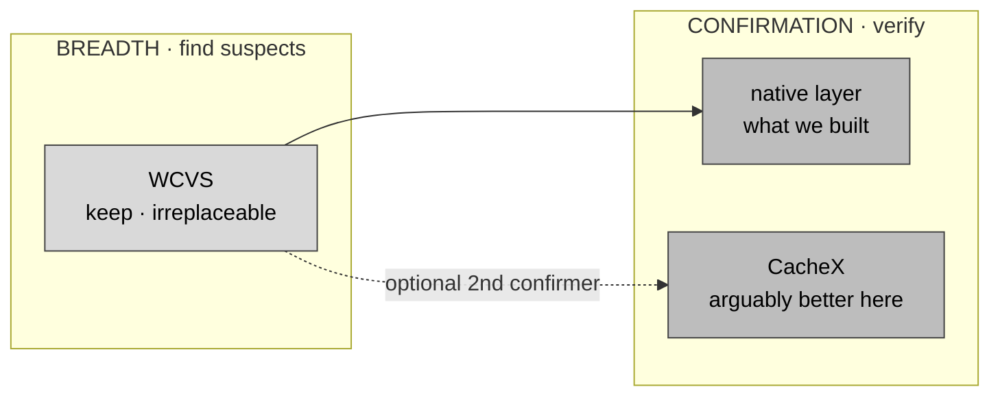

WCVS and CacheX are **not substitutes** - they solve different halves: WCVS = breadth
(10+ technique classes incl. deception, a crawler, mature packaging) → the right
*primary* engine; CacheX = depth (concurrent persistence checker, behavioural diffing)
→ a strong *confirmer*, narrower coverage, newer. We kept WCVS for breadth and built a
**native** confirmer instead of adopting CacheX, for tighter integration (own
scoring/safety/graph), zero new runtime dependency, and technology-fingerprint-aware
hypotheses.

CacheX's most valuable idea - **behavioural (differential) diffing** to catch
non-reflective poisoning - has since been **ported natively** into `confirm.py`
(Phase 4) and its header payload list folded into `hypotheses.py` (Phase 3), under
RedAmon's benign-canary safety rules and FP guard. The one CacheX advantage still **not**
ported is **concurrent race-winning** (sending many poison requests to beat short-TTL
eviction). If that recall matters, the remaining upgrade is to add CacheX as a **second**
confirmer behind the `wcvs_runner.py` docker-in-docker pattern (a finding survives if
native *or* CacheX confirms) - not to replace WCVS.

---

## 16. Known limitations (be honest)

- **Single-shot poison.** The native confirmer sends one poison request, then checks.
  On busy / short-TTL caches a poison may not reliably land before eviction - possible
  **false negatives**. (CacheX uses concurrent race-winning attempts.)
- **Reflection + differential.** Confirmation now catches both a reflected canary
  *and* non-reflective poisoning (persisted `Location` / status / body change), the
  latter ported natively from CacheX's detector. Remaining blind spot: a non-reflective
  poison that only changes a response dimension the FP-guard marked **untrusted**
  (e.g. body-diff on a page whose body legitimately flaps every request) is suppressed
  to avoid false positives - a deliberate recall-for-precision trade.
- **Deception is weak.** True web-cache-deception needs an authenticated victim and a
  private-data-leak check; the poisoning-shaped loop tends to score it below threshold.
- **Framework packs go stale.** `x-invoke-status`, `__nextDataReq`, etc. are
  version-specific; they are maintenance surface in `hypotheses.py`.
- **Partial-recon apex filtering** drops apex BaseURLs but not apex `resource_enum`
  endpoints (edge case when root-domain scope is off).
- **Confirmation concurrency** is bounded by `WEB_CACHE_POISON_CONFIRM_WORKERS` (URLs
  in flight, default 6) - this caps simultaneous load and doubles as a stealth knob -
  but there is still no per-request rps throttle inside the native layer (WCVS itself
  honors the rps setting). Vectors within a single URL are confirmed sequentially.
- **WCVS is thorough and slow per URL** (hundreds of requests/URL across techniques);
  budget the 1800 s default accordingly.

---

## 17. Build / restart / verify

| Change | Action |
|---|---|
| `recon/cache_scan/**`, `recon/partial_recon*` | `docker compose --profile tools build recon` (code is baked, not mounted) |
| `wcvs/Dockerfile` | `docker compose --profile tools build wcvs` |
| `graph_db/mixins/cache_mixin.py` | volume-mounted into scan containers (no rebuild for scans); rebuild `agent` for the chat agent |
| `webapp/src/**` | `docker compose restart webapp` + hard refresh |
| `prisma/schema.prisma` | `docker compose exec webapp npx prisma db push` |
| `agentic/prompts/base.py` | `docker compose build agent && docker compose up -d agent` (chat agent NL-to-Cypher) |

**Verify end to end:** enable the tool on a project, run recon; the GROUP 6 fan-out log
lists `cache_scan`; `combined_result["cache_scan"]` is populated; confirmed findings
appear as `Vulnerability {source:'cache_poisoning'}` linked via `HAS_VULNERABILITY`.

**Tests:**
- `recon/tests/test_cache_scan.py` - 32 unit tests (parser, oracle, buster, confirm
  against a stateful vulnerable-cache fake, scoring, safety, WCVS→vector mapping,
  scanner targets/RoE).
- `recon/tests/test_cache_scan_integration.py` - live Neo4j (node creation, full
  BaseURL→Endpoint→Vulnerability wiring, MERGE idempotency). Run with:
  ```
  docker run --rm --network host -e NEO4J_URI=bolt://localhost:7687 \
    -e NEO4J_USER=neo4j -e NEO4J_PASSWORD=<pw> --entrypoint python3 \
    redamon-recon:latest -m unittest recon.tests.test_cache_scan_integration
  ```

---

## 18. Glossary

- **Cache key** - the request components a cache uses to decide "same request?".
- **Keyed / unkeyed** - components included in / ignored by the cache key. Unkeyed +
  backend-trusted = the poisoning door.
- **Cache buster** - a unique value forcing a fresh cache entry, used to isolate tests.
- **Canary** - a benign, recognisable marker injected as the payload.
- **Poisoning vs deception** - poisoning *pushes* a malicious response to all victims;
  deception *pulls* a victim's private response out of the cache.
- **CPDoS** - cache-poisoned denial of service (serving an error/oversized response to
  everyone). Off by default.
- **Cache oracle** - a reliable signal (here, header-based) of whether a response was
  a cache hit or miss.
